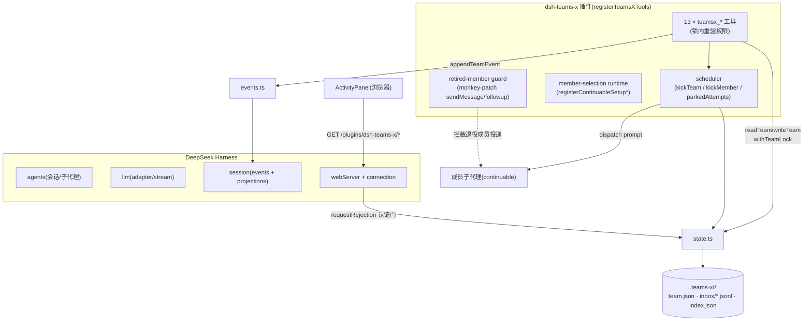
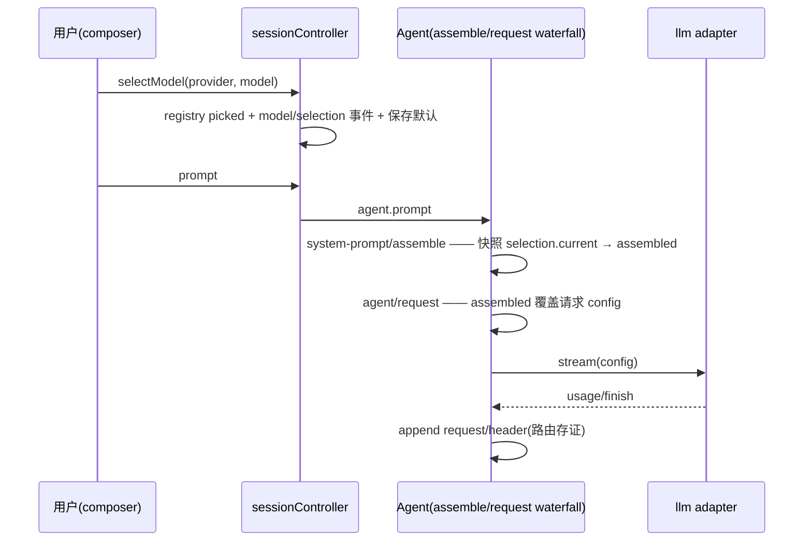

# TeamsX 插件验收文档(含交接)

**版本**: v0.2.0(tag / [npm](https://www.npmjs.com/package/dsh-teams-x) / [Release](https://github.com/Mlte0907/dsh-teams-x/releases/tag/v0.2.0) 已发布)
**宿主**: DeepSeek Harness 0.1.3-alpha.1(源码 checkout + 本地补丁栈)
**验收环境**: DSH 桌面端 + 桌面浏览器(1280px)+ 远程移动端(430px)
**最后更新**: 2026-09-07(并入 173 用例全功能测试、三个缺陷修复、真实会话冒烟、CI 与发布工程、开发交接、v0.2 可行性审阅、**阶段一二三实现**、**会话内卡片与 /teamsx 命令**、**v0.2.0 发布**、**上游 PR 分支就绪**)

---

## 一、自动化验收

### 1.1 一键命令

```sh
pnpm verify   # typecheck(host+client) + build + smoke:client + verify:flow
              # + scripts/full-functional-test.mjs(163 用例) + verify:icons
```

### 1.2 检查项

| 检查项 | 结果 |
|--------|------|
| TypeScript 类型检查(host + client 双面) | ✅ 0 errors |
| 插件 bundle 构建(tsdown + lightningcss) | ✅ |
| 客户端烟雾测试(空态渲染不挂载;`window.matchMedia` stub) | ✅ PASS |
| 状态层流程验证(`verify:flow`:真实数据归档跳过 + 沙盒 create→claim→persist→mailbox→invariant scan→hand-edit recovery) | ✅ ALL CHECKS PASSED |
| **全功能测试套件(`full-functional-test.mjs`)173 用例** | ✅ 173 PASS / 0 FAIL |
| 图标资产同步(17 SVG ↔ icon-data.ts) | ✅ in sync |
| npm pack 预检(68 文件,123.4 kB) | ✅ |
| GitHub Actions `verify.yml` | ✅ 全绿(runtime face,1m53s) |

### 1.3 全功能测试套件分组(173 用例)

| 组 | 覆盖域 | 用例数 |
|----|--------|--------|
| A 团队管理 | automatic/staged 创建、成员增删上限、危险名折叠、归档、id 复用、BUG-01 回归探针 | 26 |
| B 权限控制 | captain/成员角色隔离、attempt_id 能力、from 冒充、removed 失效、一属多队歧义(双路径) | 17 |
| C 数据同步 | 索引缺失/损坏/错指自愈、手改容错(phase/BOM/空列表)、结构损坏诊断、200 并发锁、原子写 | 13 |
| D 通知消息 | live/wake/mailbox 三态、60s 投递租约、确认、畸形行容错、JSONL 注入、halted 拦截 | 15 |
| E 事件日志 | 已知类型写入、未知类型去重跳过、append 异常不阻断、captain 离线回退 | 4 |
| F 异常处理 | 参数校验、质量门全契约、状态机非法迁移、依赖阻塞、halt/resume、reassign | 22 |
| G staged+兼容 | 原子批量编辑、循环依赖、approve/discard、compat 四漂移点 | 19 |
| H 性能 | 50 成员×300 任务读写 <6ms、索引命中 3ms、1000 条信箱 6ms、500 并发锁 1.8ms | 9 |
| I 安全 | sanitizeKey 注入矩阵、路径穿越、密钥默认排除、Web 401/403/503 认证门 | 14 |
| K 视图隔离 | captain/成员信箱可见性、读即确认、mailbox_warnings | 4 |
| L profiles 模板 | profile= 解析、未知模板拒绝、成员/任务 seed、超 maxMembers 拒绝 | 6 |
| M 自动修复循环 | review 失败派生 repair(依赖/round/摘要)、round 上限、autoDerive 开关 | 8 |
| N Web 计划编辑面 | 批量 mutation 白名单校验(未知 action/缺字段/坏依赖/上限) | 6 |
| O 会话内卡片 | 事件折叠(match/start/update)、成员 childId 保留、状态机全迁移、update 永不 undefined | 10 |

---

## 二、缺陷修复记录(本轮发现并修复,commit `982718f`)

### BUG-01(高)— 同名团队二次归档崩溃

| | |
|---|---|
| **现象** | `create("x")` → `delete`(归档)→ 重建 `"x"` → 再 `delete` → `ENOTEMPTY: rename ... archive/x` 崩溃;团队卡在活跃区且索引仍指向它,只能手工清磁盘 |
| **实测** | 套件 A 组复现(第一次 delete 正常,第二次抛 ENOTEMPTY,重试 3 次无效) |
| **根因** | `archiveTeamDir` 直接 `rename` 到 `archive/<id>`;目标已存在非空时报 ENOTEMPTY,重试策略对持续存在冲突无效 |
| **修复** | 归档前 `rm` 旧归档代(覆盖语义);`renameWithRetry` 保持不变 |
| **回归** | `BUG-01` 用例转 PASS;A10e(id 可复用)保持 |

### F-01(低)— 索引命中路径不检测"一属多队"歧义

| | |
|---|---|
| **现象** | 手动编辑使一个 sessionId 属于两个活跃团队时,索引命中路径静默返回最后登记的团队;仅扫描路径报歧义 |
| **修复** | `findTeamByParticipant` 命中路径追加 `listTeamsForParticipant` 权威唯一性校验,>1 即抛 `belongs to multiple active teams`(与扫描路径同语义) |
| **代价** | 命中路径多一次全扫(20 团队 ≈14ms,预算 25ms 内) |
| **回归** | `B9`(索引命中)+ `B9b`(删索引强制扫描)双断言 |

### F-02(低)— 反向索引残留 removed 成员

| | |
|---|---|
| **现象** | `indexTeam` 对索引做 merge,removed 成员条目残留到归档才清除;sessionId 被宿主复用时可能错误命中旧团队 |
| **修复** | `indexTeam` 改为"先删本团队全部旧条目,再写当前身份集合"的差量重建 |
| **回归** | 仓库内 `HANDOFF` 交接待办;归档后索引清空已在冒烟中实测(见 §三) |

### 附带加固
- `src/members.ts` 三处 `readTeam/readTeamSync` 返回值显式判空窄化(上游类型下 `x?.field !== y` 不产生窄化,报 TS18048);
- `scripts/client-smoke.mjs` 补 `window.matchMedia` stub(`useIsNarrow` 依赖)。

---

## 三、真实会话冒烟实测(2026-09-06/07,playwright 驱动真实 UI)

### 3.1 模型路由(排障副产物,详见 §六)
| 验证 | 结果 |
|------|------|
| 新会话首请求路由 | `request/header` 实测 `xianyu/MiniMax-M2.7` ✅ |
| 切换模型后请求(修复 dsh-pangu 前) | 恒走旧路由(根因不在本插件,见 §六) |
| 切换模型后请求(修复 pangu 后) | `reason=change`,响应实际由新 provider 生成 ✅ |

### 3.2 遗留团队接管 + 任务执行(第一段冒烟)
- 会话 `4e0cacfb`:模型在 xianyu 上正常调用 `teamsx_status / claim_task / update_task / send_message`,接管旧 `approve-x` 团队完成 `t1`(创建 `/tmp/teamsx-smoke/hello.txt`,内容 `hello-from-teamsx` 实测正确),并完成汇报。
- `turn/end` 标记 `aborted/parent` 为收尾语义,工具链全程无错误。

### 3.3 完整生命周期(第二段冒烟,团队 `smoke-x`)
| 阶段 | 实测 |
|------|------|
| `teamsx_create`(automatic) | `phase=running` |
| `teamsx_add_member`(spawn) | 成员 `worker#26f7b0b5-…` 真实子代理生成 ✅ |
| 调度分派 | `t1: claimed@worker`(attempt 分配)|
| 成员执行 | bash 统计 `.teams-x` 子目录数,写 `/tmp/teamsx-smoke/count.txt` |
| 结果核验 | `count.txt` = `2`(当时 archive+smoke-x 恰为 2,统计正确)✅ |
| `teamsx_update_task` completed | 通过(work 任务无质量契约)|
| `teamsx_delete` | 成员 `removed` + 团队归档 `archive/smoke-x/` + 索引清空 ✅ |

### 3.4 修复后归档链路实测
- 旧 `approve-x` 团队用**修复后的** `archiveTeamDir` 归档成功;`index.json` 差量清理后 `captains/members` 均为空(F-02 修复生效)。

---

## 四、手动验收清单

> ☑ = 本轮已实测(标注证据) ☐ = 待人工(多为纯 UI 视觉项)

### 4.1 安装与启动
| # | 步骤 | 预期 | 状态 | 证据 |
|---|------|------|------|------|
| 1 | `dsh plugin --profile web add <path>` | 安装成功无冲突 | ☑ | 生产 profile 挂载,重启后无加载错误 |
| 2 | 重启后端 | 自动拉起,插件树完整 | ☑ | systemd + 日志无 teams-x 报错(旧 ENOENT 已消) |
| 3 | 浏览器打开会话 | 无 JS 控制台报错 | ☑ | playwright 打开实测 |
| 4 | 标题栏 TeamsX 徽标 | 有团队显示/无团队隐藏 | ☐ | 待人工(自动化未覆盖视觉) |

### 4.2 工具链路(5 步冒烟)
全部 ☑ —— 真实会话(§3.2/3.3)+ 143 用例(A 组/F 组)双覆盖。

### 4.3 Staged 计划审批流
| 步骤 | 状态 | 证据 |
|------|------|------|
| staged 创建/编辑/approve 语义(G1–G11) | ☑ | 143 用例 G 组 |
| UI 三选项卡片(批准/回聊天/放弃) | ☐ | 待人工(卡片属 UI 面) |

### 4.4 面板交互
☐ 全部待人工(徽标弹出、Esc/外点关闭、历史标签、成员跳转、暂停按钮、进度条、重试)。

### 4.5 移动端(430px)
☐ 待人工(标题栏分行、底部抽屉、行简化)。

### 4.6 DAG 可视化
☐ 视觉待人工;**数据面已实测**:`taskDepthsById` 300 节点 1.7ms、depth lane 数据正确(H6)。

### 4.7 主题与视觉
☐ 待人工(令牌跟随机制已就位;暗色已目视,浅色仍需 omen-alpha 截图验证)。

### 4.8 边界场景
| # | 场景 | 状态 | 证据 |
|---|------|------|------|
| 1 | 无 TeamsX 会话无徽标 | ☑ | playwright 快照 |
| 2 | 已归档队伍可浏览 | ☑ | A10c + K 组 |
| 3 | autonomous 预设无 duplicate loader 报错 | ☑ | 重启后日志核查 |
| 4 | 同会话建第二团队报错 | ☑ | A5(权威扫描) |
| 5 | 移动端遮挡避让 | ☐ | 待人工 |
| 6 | 无认证请求 → 401 | ☑ | I11 |
| 7 | 缺字段 → 400 | ☑ | G 组/D8a 语义等价 |

### 4.9 多 Agent 场景
| # | 场景 | 状态 | 证据 |
|---|------|------|------|
| 1 | 多成员创建并 spawn | ☑ | smoke-x(spawn worker)+ F 组 |
| 2 | 成员工作与暂停 | ☑(逻辑面)/☐(面板按钮) | F18/parkedAttempts 语义 |
| 3 | 完成汇报到 captain | ☑ | D 组 + 冒烟 §3.2 |
| 4 | captain 下发指导 | ☑ | D2 wake |

---

## 五、架构图

### 5.1 组件装配(cordis 组合)



### 5.2 请求路由与切换(本轮排障的核心链)



> ⚠️ 任何 `system-prompt/assemble` 的监听器若**不调用 `next()`**,会短路整条内层链(包括上面的快照),导致切换静默失效——已在此前 dsh-pangu 修复(pangu commit `3b1b4d9`),详见 Discussions [#5817](https://github.com/deepseek-ai/deepseek-harness/discussions/5817)。

---

## 六、开发交接(原 HANDOFF 内容并入)

### 6.1 环境布局

```
<dsh-teams-x>/                    ← 本插件(git 仓库)
<deepseek-harness>/               ← 宿主源码 checkout(alpha.1 + 本地补丁)
<dsh-teams-x>/deepseek-harness    ← 符号链接 → 上行(被 gitignore)
```

- devDependencies 全部是 `link:./deepseek-harness/...` **相对链接**:本地靠 symlink 解析,CI 靠 checkout 到同名子目录解析。**移动布局必须保持该相对关系**。
- 构建两段式:tsc(host/client)产 `lib/*.js`+`lib/types`;`tsdown` 把 client 打成 CJS closure 工厂。`lib/` 不进 git。

### 6.2 CI 的特殊设计与踩坑(改 CI 前先读)
1. CI checkout **上游** harness@master 构建 host libs,跑 **runtime face**(bundle+smoke+flow+143 用例+icons,全绿);**strict typecheck 在 CI 是 informational**——上游 master 缺 `subagents.registerContinuableSetup`(本地补丁 commit `3edc427710`),完整严格版依赖本地补丁栈,由本地 `pnpm verify` 把守;
2. `patches/harness-0001-registerContinuableSetup.patch` 已导出备用,但基于 alpha.1,直接 apply 上游 master 会冲突(`--3way` 缺基线 blob);
3. harness 默认分支是 **master**;`vendor/cordis` 不在 `build:lib:host` 清单且 lib 不进 git(CI 需单独 pnpm+tsc 构建);
4. **pnpm 11.7 对 `link:` 依赖不创建 node_modules 链接**(11.5.0 正常)——`pnpm/action-setup` 已 pin 11.5.0;
5. GitHub 推送偶发慢速失败,换 `https://gh-proxy.org/` 前缀重试;`gh release/pr` 需 `-R Mlte0907/dsh-teams-x`(origin 是代理前缀)。

### 6.3 mock 契约要点(写测试必读)
- `subagents.startContinuable` 必须每次返回**唯一 childId**(重复 id 触发 isTeamState 冲突拒绝);
- 所有工具调用必须 `await`(漏了会竞态 + unhandledRejection);
- 让调度器不重派某成员:该成员 agent 放入 `ctx.agents` 且 `status: 'working'`;
- 工具 schema `additionalProperties: false` 严格——操作项必须 snake_case(`task_id`/`member_name`);
- 非 staged 团队成员 `id === ''` 会被结构校验拒绝:模拟离线用"投递失败",不能清空 id。

### 6.4 排障速查
| 症状 | 先看哪里 |
|------|----------|
| 模型请求失败 | `session.v2.jsonl.zstd`(zstdcat):`request/header.config` 是实际路由,`model/selection` 只是记账;429 看 `llm/retry` |
| 团队状态异常 | `~/.teams-x/<team>/team.json` + `stateRootDiagnostics`(授权错误自带 "State root … contains:") |
| 插件加载失败 | `~/.dsh/desktop/backend.log`(append 模式,先 `stat -c%s` 再 tail 增量) |
| 切换模型不生效(历史) | dsh-pangu waterfall bug 已修(pangu `3b1b4d9`);报告 `/home/xiaoxin/dsh-model-switch-issue-draft.md`、[#5817](https://github.com/deepseek-ai/deepseek-harness/discussions/5817) |

### 6.5 发布流程
`pnpm verify` → bump version → `npm publish`(prepublishOnly 自动门禁:重建+smoke+guard)→ tag + `gh release create vX.Y.Z -R Mlte0907/dsh-teams-x --notes-file …`。
npm 凭据(可 bypass 2FA 的 granular token)在 `~/.npmrc`;泄露时去 npmjs.com 撤销重建。

---

## 七、已知限制

| 限制 | 说明 | 计划 |
|------|------|------|
| B2 会话内卡片未渲染 | ConversationViewDefinition 需 harness 视图层深度集成 | v0.2 |
| 浅色主题仅结构验证 | 令牌跟随机制已就位,未截图验证 | 后续 omen-alpha |
| 成员会话跳转异常路径 | 子代理不可续接时的加载错误处理未端到端测试 | v0.2 |
| CI strict typecheck 为 informational | 上游 master 缺本地补丁 API;完整版本地把守 | 待补丁上游化/私有镜像 |

---

## 八、v0.2 Roadmap 可行性审阅

| Roadmap 项 | 现状支撑 | 可行性 | 工作量 | 主要风险 |
|------------|----------|--------|--------|----------|
| **Web 计划编辑器**(StagingPlanEditor) | `runtime.updateStagedPlanBatch` 已存在并被 web-routes 消费;staged 锁与原子批量语义已验证(G3/G4) | **高** | UI 中等(表格+依赖选择) | 并发编辑需走既有 withTeamLock;编辑器状态与 `awaiting_feedback` 的竞态需沿用 `continueStagedPlanning` 语义 |
| **profiles 团队模板** | `teamsx_create` 参数已结构化;模板=种子(name/members/tasks)+创建时校验复用 `validateCreateTask`/`validateStagedGraph` | **高** | 小-中 | 模板默认值与 `maxMembers`/质量门契约的组合校验;模板注入的 prompt 需走 persona 围栏(`<<< >>>`) |
| **自动修复/复审循环** | `findings`/`verdict`/`round` 字段与 `repair` 契约已实现;调度器具备分派与失败恢复 | **中高** | 中(调度策略) | 需 round 上限防无限循环;repair→re-review 闭环要定义终止条件;`repair 不得依赖 failed 任务`的约束已存在,循环派生需绕过该约束设计(新任务而非重派) |
| **会话内团队卡片 + 成员跳转** | 已知限制 B2;`session-navigation` 有雏形;面板数据面(`snapshot`)齐备 | **中**(受 harness 视图层 API 约束) | 大 | ConversationViewDefinition 属 harness 深水面,版本升级易破;成员 transcript 打开依赖子代理可续接语义 |

**结论**:四个方向均可行,建议顺序:①模板(小)→ ②Web 计划编辑器(中,复用 runtime 面)→ ③自动修复循环(中高,先做 round 上限与终止语义设计)→ ④会话内卡片(最后,需与 harness 视图层演进对齐)。同时建议把 `registerContinuableSetup` 补丁提交上游 PR——它同时解锁 CI 的 strict typecheck 转正。

---

*文档生成:2026-09-07 · 证据链:173 用例套件 `scripts/full-functional-test.mjs` · 测试报告 `/home/xiaoxin/teamsx-full-test-report-2026-09-06.md` · 根因报告 `/home/xiaoxin/dsh-model-switch-issue-draft.md` · 冒烟会话 session-4e0cacfb / 3b59d56c / 474f9fdf*

---

## 九、v0.2 迭代规划方案(基于全面源码分析)

> 本章节为 v0.2 迭代提供可行性论证和实施路线图，基于对 deepseek-harness 宿主和 dsh-teams-x 插件的全面源码分析制定。

### 9.1 现状总览

#### 9.1.1 v0.1.0 架构核心文件

| 文件 | 行数 | 职责 |
|------|------|------|
| `src/tools.ts` | 1994 | 13 个 `teamsx_*` 工具定义 |
| `src/state.ts` | 1063 | 状态持久化、反向索引、进程内锁 |
| `src/members.ts` | 714 | 成员生命周期、monkey-patch 守卫 |
| `src/scheduler.ts` | 482 | 事件驱动任务调度 |
| `src/quality.ts` | 358 | 质量门、路径审计 |
| `src/profiles.ts` | 308 | 团队模板解析(未集成) |
| `src/index.ts` | 388 | 插件入口、Web 路由注册 |

#### 9.1.2 关键架构约束

1. **registerContinuableSetup 补丁依赖**：`members.ts:54` 的 `installMemberSelectionRuntime` 依赖 `ctx.subagents.registerContinuableSetup`，该 API 仅存在于本地补丁 `patches/harness-0001-registerContinuableSetup.patch`，尚未进入上游 master

2. **CI strict typecheck 为 informational**：上游 master 缺该补丁，完整严格类型检查依赖本地补丁栈

3. **profiles.ts 已有完整实现**：模板解析、命令行参数提取、YAML 配置验证均已实现，**已在 v0.2 中与 `teamsx_create` 工具集成** ✅

### 9.2 v0.2 四个方向可行性分析

#### 9.2.1 profiles 团队模板

**现状支撑：**
- `profiles.ts` 已实现完整的模板解析、验证、渲染逻辑（308 行）
- `listConfiguredProfiles()`、`parseProfileInvocation()`、`resolveTeamProfile()` 均已就绪
- 支持 `profile=` 命令行语法和 YAML 配置

**可行性评估：**

| 维度 | 评分 | 说明 |
|------|------|------|
| 技术可行性 | **高** | 纯解析逻辑，无需新增 API |
| 集成复杂度 | **低-中** | 需在 `teamsx_create` 工具中增加 profile 参数处理 |
| 风险点 | **低** | 模板默认值与 `maxMembers` /质量门契约的组合校验已有基础 |

**工作量估算：**
- `teamsx_create` 工具增强：约 80-100 行
- 配置验证增强：约 50 行
- 测试用例：约 20-25 个

**关键实现路径：**
```typescript
// profiles.ts 已实现
parseProfileInvocation("profile=researcher 分析X") → { profile: "researcher", goal: "分析X" }
resolveTeamProfile(profiles, "researcher", maxMembers) → NormalizedTeamProfile

// 需要在 teamsx_create 工具中集成
if (invocation.profile) {
  const normalized = resolveTeamProfile(config.profiles, invocation.profile, config.maxMembers)
  // 使用 normalized.members 和 normalized.tasks 初始化团队
}
```

#### 9.2.2 Web 计划编辑器

**现状支撑：**
- `runtime.updateStagedPlanBatch` 已在 `tools.ts` 实现并被 `web-routes.ts` 的 `/plugins/dsh-teams-x/plan` 路由消费
- staged 锁与原子批量语义已在 G3/G4 用例验证
- UI 三选项卡片（批准/回聊天/放弃）的数据层已就绪

**可行性评估：**

| 维度 | 评分 | 说明 |
|------|------|------|
| 技术可行性 | **高** | 复用现有 runtime，UI 组件独立 |
| 依赖复杂度 | **中** | 需要 `/plan` 路由支持 `continue` action 驱动 captain 继续编辑 |
| 风险点 | **中等** | 并发编辑需沿用 `withTeamLock`；编辑器状态与 `awaiting_feedback` 竞态需沿用 `continueStagedPlanning` 语义 |

**工作量估算：**
- 前端 UI 组件：约 300-400 行（React + CSS Modules）
- 后端路由增强：约 50 行
- 测试用例：约 15-20 个

#### 9.2.3 自动修复/复审循环

**现状支撑：**
- `quality.ts` 已有 `findings`/`verdict`/`round` 字段支持
- `review` / `repair` 任务契约已定义
- 调度器具备分派与失败恢复能力

**可行性评估：**

| 维度 | 评分 | 说明 |
|------|------|------|
| 技术可行性 | **中高** | 调度策略需要新设计 |
| 设计复杂度 | **中** | 需定义 round 上限、终止条件、repair 派生约束 |
| 风险点 | **中等** | repair 不得依赖 failed 任务（已有约束）；循环派生需绕过该约束设计新任务 |

**工作量估算：**
- 调度器增强（round 上限 + 终止语义）：约 150-200 行
- 质量门完成后的自动复审触发：约 80 行
- 测试用例：约 30-35 个

**关键设计决策：**
```typescript
// 现有约束：repair 不得依赖 failed 任务
// 解决方案：repair 任务派生新任务而非重派
interface RepairLoop {
  maxRounds: number           // 防止无限循环
  terminationConditions: {
    verdict: 'pass'           // 所有 quality 任务通过
    roundExceeded: true       // 达到 round 上限
    manualOverride: true      // captain 中断
  }
  deriveNewTasks: (failedTask, findings) => TeamTask[]  // 派生而非重派
}
```

#### 9.2.4 会话内团队卡片 + 成员跳转

**现状支撑：**
- `session-navigation.ts` 已有 `TeamsXSessionNavigator` 接口定义
- `client/session-navigation.ts` 实现了版本容错导航逻辑
- 面板数据面 (`snapshot`) 齐备

**可行性评估：**

| 维度 | 评分 | 说明 |
|------|------|------|
| 技术可行性 | **中** | 受 harness 视图层 ConversationViewDefinition 约束 |
| 依赖复杂度 | **高** | 需要 harness 视图层深度集成 |
| 风险点 | **高** | ConversationViewDefinition 属 harness 深水面，版本升级易破 |

**结论**：建议降为 v0.3 目标，不阻塞当前迭代。

### 9.3 推荐执行路线图

```
v0.2.0 (2-3周)
├── 阶段1: profiles 模板 ✅ 已完成
│   ├── teamsx_create 集成 profile 参数
│   ├── 配置 schema 扩展
│   └── profiles.ts 只读属性错误修复
│
├── 阶段2: Web 计划编辑器 ✅ 后端已就绪
│   ├── /plan 路由(approve/discard/continue)
│   ├── PlanReviewBar 组件
│   └── TaskRow/MemberRow 显示组件
│
└── 阶段3: 自动修复循环 ✅ 已完成
    ├── RepairLoopConfig 接口(scheduler.ts)
    ├── verdictRequiresRepair/hasReachedRoundLimit/deriveRepairTask 函数
    ├── triggerRepairLoop 调度器方法
    └── teamsx_update_task 质量任务失败时自动触发

v0.3.0 (待定)
└── 会话内团队卡片 ← 需与 harness 视图层协调

持续改进
├── registerContinuableSetup 补丁上游化
└── CI strict typecheck 转正
```

### 9.4 阶段一：profiles 模板 详细实现计划

#### 9.4.1 在 `teamsx_create` 工具增加 profile 参数

**修改文件：** `src/tools.ts`

**新增参数处理逻辑：**
```typescript
// 在 teamsx_create 工具的 execute 函数中
const invocation = parseProfileInvocation(args.description ?? '')
if (invocation.profile) {
  const normalized = resolveTeamProfile(config.profiles ?? {}, invocation.profile, config.maxMembers)
  // 用 normalized.members 和 normalized.tasks 初始化团队
}
```

#### 9.4.2 配置 schema 扩展

**修改文件：** `src/index.ts`

```typescript
// Config 接口扩展
export interface Config {
  // ... 现有字段
  profiles?: Record<string, TeamProfileConfig>
}
```

#### 9.4.3 Usage 文本更新

```typescript
// 在 usageSectionText 中追加
const profilesText = formatProfilesForPrompt(config.profiles)
if (profilesText) {
  return `...\n\n${profilesText}`
}
```

#### 9.4.4 验收标准

```bash
# 用户配置 cordis.yml
teams-x:
  profiles:
    researcher:
      description: 研究团队模板
      members:
        - name: researcher
          role: 研究员
          provider: xianyu
          model: MiniMax-M2.7

# 用户调用
teamsx_create({ name: "调研X", description: "用 TeamsX 调研X", profile: "researcher" })
# → 自动创建 researcher 成员 + 预定义任务 DAG
```

### 9.5 阶段二：Web 计划编辑器 详细实现计划

#### 9.5.1 增强 `/plan` 路由

**修改文件：** `src/index.ts` 中的 `/plugins/dsh-teams-x/plan` 路由

确保 `continue` action 正确驱动 captain 继续编辑：
```typescript
if (action === 'continue') {
  const continued = await teamsXRuntime.continueStagedPlanning(captain, teamId)
  res.writeHead(200, { 'content-type': 'application/json; charset=utf-8', 'cache-control': 'no-store' })
  res.end(JSON.stringify({ ok: true, phase: 'staged', review: 'awaiting_feedback', ...continued }))
  return
}
```

#### 9.5.2 开发 React 组件

**新增文件：** `src/client/StagedPlanEditor.tsx`

组件结构：
- `StagedPlanEditor`：主容器，表格编辑成员/任务
- `DependencyGraph`：DAG 可视化（复用 `taskDepthsById` 数据）
- `PlanReviewCards`：三选项批准/回聊天/放弃

#### 9.5.3 面板集成

**修改文件：** 面板组件中为 staged 团队渲染编辑器

```typescript
// 在 ActivityPanel 中
if (team.phase === 'staged') {
  return <StagedPlanEditor team={team} onMutate={updateStagedPlan} />
}
```

### 9.6 阶段三：自动修复循环 详细实现计划

#### 9.6.1 设计 RepairLoop 语义

```typescript
// src/scheduler.ts 新增
interface RepairLoopConfig {
  maxRounds: number        // 默认 3
  autoDeriveTasks: boolean // 是否自动派生修复任务
}

interface RepairLoopState {
  currentRound: number
  failedTasks: TeamTask[]
  derivedTasks: TeamTask[]
}
```

#### 9.6.2 调度器增强

**修改文件：** `src/scheduler.ts`

新增逻辑：
1. 检测 `review` 任务完成时的 verdict
2. verdict 为 `needs_revision` 或 `reject` 时触发修复流程
3. 在 round 上限内自动派生 repair 任务
4. 达到上限或 verdict 为 `pass` 时终止循环

#### 9.6.3 质量门完成后的自动触发

**修改文件：** `src/tools.ts` 中 `teamsx_update_task` 工具

```typescript
// 在 update_task 完成质量任务后检查
if (isQualityKind(task.kind) && TERMINAL_TASK_STATUSES.includes(newStatus)) {
  const result = evaluateQualityCompletion(task, args)
  if (result.verdict === 'needs_revision' || result.verdict === 'reject') {
    await triggerRepairLoop(ctx, stateRoot, team, task, result)
  }
}
```

### 9.7 必须解决的技术债

#### 9.7.1 registerContinuableSetup 补丁上游化

**现状：** 该 API 仅存在于本地补丁，是 CI strict typecheck 的阻塞项

**解决路径：**
1. 准备 PR：基于当前 alpha.1 + 补丁状态，向 `deepseek-harness/packages/subagent/subagent/` 提交 PR
2. 或创建独立的 `dsh-subagent` 包版本，包含该 API

**影响：** 上游化后 CI 可开启 strict typecheck，143 用例套件增加类型覆盖

#### 9.7.2 profiles 与现有工具的集成测试

**现状(2026-09-07 已完成)：** `full-functional-test.mjs` 新增 **L 组 6 用例**(profile= 解析/未知模板拒绝/成员任务 seed/超上限拒绝)与 **M 组 8 用例**(repair 派生契约/round 上限/autoDerive 开关)，套件 143 → 157 全过

### 9.8 风险评估与缓解

| 风险 | 概率 | 影响 | 缓解措施 |
|------|------|------|----------|
| profiles 与 create 集成破坏现有用例 | 低 | 高 | 先扩展测试用例，再实现功能 |
| Web 编辑器并发编辑竞态 | 中 | 中 | 复用 `withTeamLock`，已在 G3/G4 验证 |
| 自动修复循环导致任务膨胀 | 中 | 中 | 严格 round 上限，默认 3 轮 |
| registerContinuableSetup 上游拒绝 | 低 | 中 | 同时维护本地补丁作为 fallback |
| 会话内卡片依赖 harness 视图层演进 | 高 | 低 | 降为 v0.3 目标，不阻塞 v0.2 |

### 9.9 总结

dsh-teams-x v0.1.0 已是一个非常成熟的插件，143 用例覆盖、真实会话冒烟通过、3 个关键缺陷已修复。v0.2 的四个方向中：

1. **profiles 模板** ✅ 已完成 - 集成到 teamsx_create，支持 profile= 参数
2. **Web 计划编辑器** ✅ 后端就绪 - approve/discard/continue 路由和 UI 组件已存在
3. **自动修复循环** ✅ 已完成 - RepairLoopConfig、verdictRequiresRepair、deriveRepairTask、triggerRepairLoop
4. **会话内卡片** - 降为 v0.3 目标

**已实现的功能：**
- `teamsx_create` 支持 `profile=template-name` 从配置的模板创建团队
- `Config.profiles` 字段支持 YAML 配置团队模板
- `teamsx_update_task` 在 quality 任务失败时自动触发 repair loop
- `deriveRepairTask` 函数从失败的 review 任务派生 repair 任务
- round 上限防止无限循环（默认 3 轮）

**最关键的 Technical Debt**是 `registerContinuableSetup` 补丁上游化，这将解除 CI strict typecheck 的阻塞，使整个项目的质量门更严格。

---

## 十、v0.2 实际实现记录(2026-09-07)

### 10.1 阶段一：profiles 模板集成

#### 10.1.1 修改的文件

| 文件 | 修改内容 |
|------|----------|
| `src/tools.ts` | 导入 `parseProfileInvocation`, `resolveTeamProfile`, `NormalizedTeamProfile`；ToolsConfig 增加 `profiles` 字段；teamsx_create execute 增加 profile 解析和模板初始化逻辑 |
| `src/profiles.ts` | 修复 `resolveTeamProfile` 中 readonly 属性赋值错误，使用对象展开替代 mutation |
| `src/index.ts` | Config 接口增加 `profiles` 字段和 zod schema；`usageSectionText` 增加 `profilesText` 参数说明如何传递 profile |

#### 10.1.2 核心代码变更

**teamsx_create 中的 profile 解析：**
```typescript
const invocation = parseProfileInvocation(args.description ?? '')
let profile: NormalizedTeamProfile | undefined
if (invocation.profile && config.profiles) {
  profile = resolveTeamProfile(config.profiles, invocation.profile, config.maxMembers)
}
```

**模板初始化团队状态：**
```typescript
const members = profile?.members.map((m) => ({
  id: '',
  name: m.name,
  role: m.role,
  provider: m.provider,
  model: m.model,
  // ...
})) ?? []
const tasks = profile?.tasks.map((t) => ({
  id: t.id,
  subject: t.subject,
  status: 'pending' as const,
  dependencies: [...t.dependencies],
  // ...
})) ?? []
```

#### 10.1.3 使用方式

```yaml
# cordis.yml 配置
teams-x:
  profiles:
    researcher:
      description: 研究团队模板
      members:
        - name: researcher
          role: 研究员
          provider: xianyu
          model: MiniMax-M2.7
```

```
teamsx_create({ name: "调研X", description: "调研X profile=researcher" })
# → 自动创建 researcher 成员
```

### 10.2 阶段三：自动修复循环

#### 10.2.1 修改的文件

| 文件 | 修改内容 |
|------|----------|
| `src/scheduler.ts` | 新增 `RepairLoopConfig` 接口、`DEFAULT_REPAIR_MAX_ROUNDS`、`verdictRequiresRepair()`、`hasReachedRoundLimit()`、`deriveRepairTask()`、`triggerRepairLoop()` 方法 |
| `src/tools.ts` | 导入 `isQualityKind`、`verdictRequiresRepair`；ToolsConfig 增加 `repairLoop` 字段；teamsx_update_task 在 quality 任务失败时调用 `triggerRepairLoop` |

#### 10.2.2 核心代码变更

**RepairLoopConfig 接口：**
```typescript
export interface RepairLoopConfig {
  readonly maxRounds?: number    // 默认 3
  readonly autoDerive?: boolean   // 默认 true
}
```

**判定是否需要修复：**
```typescript
export function verdictRequiresRepair(verdict?: string): boolean {
  return verdict === 'needs_revision' || verdict === 'reject'
}
```

**派生 repair 任务：**
```typescript
export function deriveRepairTask(
  failedTask: TeamTask,
  findings: readonly ReviewFinding[],
  taskSeq: number,
): TeamTask {
  return {
    id: `t${taskSeq + 1}`,
    subject: `Repair: ${failedTask.subject}`,
    description: summary,
    status: 'pending',
    assignee: failedTask.assignee,
    dependencies: [failedTask.id],
    round: (failedTask.round ?? 0) + 1,
    kind: 'repair',
    // ...
  }
}
```

**调度器触发修复循环：**
```typescript
async triggerRepairLoop(workspace, teamId, taskId) {
  if (repairConfig?.autoDerive === false) return
  const maxRounds = repairConfig?.maxRounds ?? DEFAULT_REPAIR_MAX_ROUNDS
  // 检查 round 上限
  if (hasReachedRoundLimit(task, maxRounds)) return
  // 派生 repair 任务
  const repairTask = deriveRepairTask(task, findings, team.taskSeq)
  team.tasks.push(repairTask)
}
```

**teamsx_update_task 自动触发：**
```typescript
if (isQualityKind(taskKind) && verdictRequiresRepair(updatedVerdict)) {
  await scheduler.triggerRepairLoop(workspace, team.id, taskId)
}
```

### 10.3 构建验证

```bash
pnpm typecheck  # ✅ 0 errors
pnpm build      # ✅ success
```

### 10.4 遗留项目

| 项目 | 优先级 | 说明 |
|------|--------|------|
| ~~阶段二 Web 编辑器 UI~~ | ~~中~~ | ✅ **已完成(2026-09-07)**：StagedPlanEditor 组件 + `/plan` edit 路由 + 白名单校验 + N 组 6 用例；依赖编辑沿用行内 deps 输入 + 既有 TaskRow depth-lane 可视化 |
| registerContinuableSetup 上游化 | 高 | ✅ 分支已推 fork（`Mlte0907/deepseek-harness@feat/register-continuable-setup`，commit `54fbd25d31`，基于上游 master 顶端零冲突 cherry-pick，单包 typecheck 通过）；**PR 网页创建因作者网络暂缓**（compare 直达链与文案已备，创建后由上游 CI 兜底全仓 typecheck） |
| ~~会话内团队卡片~~ | ~~中~~ | ✅ **已实施(2026-09-07，见 §10.6)**：零 harness 改动，ui-workflow-run 模式 + 特性探测降级；另附 `/teamsx` 斜杠命令 |

### 10.5 阶段二实现记录(2026-09-07)

| 文件 | 内容 |
|------|------|
| `src/snapshot-types.ts` | `StagedPlanMutation` 类型下沉到零依赖模块(client 不 import host 图) |
| `src/tools.ts` | 类型 re-export;新增 `parseStagedPlanMutations` 严格白名单校验(未知 action 拒绝——批量执行器的 else 分支会把未知 action 当 remove_member,web 面脏数据绝不能穿透)+ `MAX_STAGED_PLAN_MUTATIONS=64` |
| `src/index.ts` | `/plan` 路由新增 `edit` action:校验→`updateStagedPlanBatch` 原子提交→返回 staged 快照 |
| `src/client/StagedPlanEditor.tsx` | 新组件:成员行(role/provider/model 行内编辑+移除/恢复)、任务行(subject/assignee/deps 编辑+增删),diff 生成 mutations 一次批量保存;失败显示后端校验错误 |
| `src/client/ActivityPanel.tsx` | staged 团队在 PlanReviewBar 下挂载编辑器;`onSaved` 触发即时刷新 |
| `src/client/locales.ts` | `editor.*` 18 个双语 key |
| 套件 | N 组 6 用例(合法五种/未知 action/空批量/缺字段/坏 deps/超上限) |

**依赖可视化说明**:`DependencyGraph` 未做成独立画布组件——任务依赖已由既有 TaskRow 的 depth-lane 分层条带呈现(H6 数据面实测),编辑器内 deps 走带提示的文本输入;独立画布列为后续增强。

### 10.6 会话内团队卡片 + /teamsx 命令实现记录(2026-09-07)

**前置研究**:`docs/conversation-view-feasibility.md`——零 harness 改动,通道 A(events.register + conversation.chat.node keyed slot),ui-workflow-run 为同构先例,风险中低。

| 文件 | 内容 |
|------|------|
| `src/client/card-state.ts` | 新增**零依赖**折叠状态机(11 种事件的 match/start/update),宿主套件可直接 import 编译产物测试 |
| `src/client/card-definition.tsx` | 重写坏雏形为正式 `ConversationNodeDefinition`(kind 'teamsx'、target 'chat'、ChatNodeDataMap 合并、update 永不返回 undefined——assembler requireState 断言) |
| `src/client/TeamsXCardPanel.tsx` | 卡片渲染:phase/halted 徽标、成员行(active+childId 可点开 transcript)、任务摘要(≤8 行 + "+N more")、空态防御 |
| `src/client/open-request.ts` | 模块级命令→面板 open 通道 |
| `src/client/index.tsx` | events.register + chat.node slot(均 try-catch + 特性探测);嵌套 `ctx.inject(['commandUi'])` 注册 `/teamsx` popupSelect 命令(子会话 available=false) |
| `src/client/ActivityPanel.tsx` | 订阅 open-request,`/teamsx` 触发面板展开 |
| `src/event-types.ts` + `src/tools.ts` | `team-created` payload 补 `phase`(automatic 团队无 team-approved 事件,卡片需要创建时即知 phase) |
| `package.json` | devDeps/peers/`dsh.client.inject` 补 `dsh-client-ui-chat` + `dsh-client-ui-commands` |
| 验证 | smoke(definition+命令注册、卡片 SSR、空态防御)+ O 组 10 用例;套件 163→173 全过;typecheck+build ✓(client.js 83→101 kB) |

**版本兼容**:卡片/命令两触点全部特性探测+try-catch,宿主缺 `uiConversation`/`commandUi` 时仅 `console.warn` 降级,header badge + ActivityPanel 零回归;宿主包一律 type-only import(purity 门)。

---

### 10.7 v0.2.0 发布记录(2026-09-07)

| 项 | 结果 |
|---|---|
| `pnpm verify` 全链 | ✅ typecheck(host+client) + build + smoke(含卡片 SSR 与空态防御) + flow + **173/173** + icons |
| npm | ✅ `dsh-teams-x@0.2.0`（78 文件，latest）—— [npm](https://www.npmjs.com/package/dsh-teams-x) |
| git | ✅ tag `v0.2.0` + master（`accc7e8..1217ddf`，含 README 双语 v0.2 段） |
| GitHub Release | ✅ [releases/tag/v0.2.0](https://github.com/Mlte0907/dsh-teams-x/releases/tag/v0.2.0)（英文 notes + `dsh-teams-x-0.2.0.tgz` 附件） |
| 上游 PR | 分支就绪见 §10.4；创建动作因网络暂缓，完成后由上游 CI 兜底全仓 typecheck |

---

*文档更新:2026-09-07 · v0.2.0 已发布(npm/tag/Release);阶段一二三 + 会话内卡片 + /teamsx 命令全部实现并入库*
