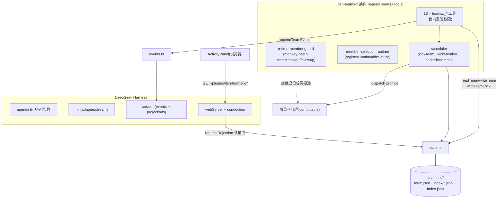
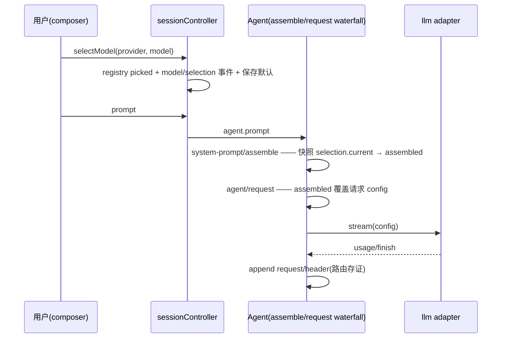

# TeamsX 插件验收文档(含交接)

**版本**: v0.1.0(tag / [npm](https://www.npmjs.com/package/dsh-teams-x) / [Release](https://github.com/Mlte0907/dsh-teams-x/releases/tag/v0.1.0) 已发布)
**宿主**: DeepSeek Harness 0.1.3-alpha.1(源码 checkout + 本地补丁栈)
**验收环境**: DSH 桌面端 + 桌面浏览器(1280px)+ 远程移动端(430px)
**最后更新**: 2026-09-07(并入 143 用例全功能测试、三个缺陷修复、真实会话冒烟、CI 与发布工程、开发交接、v0.2 可行性审阅)

---

## 一、自动化验收

### 1.1 一键命令

```sh
pnpm verify   # typecheck(host+client) + build + smoke:client + verify:flow
              # + scripts/full-functional-test.mjs(143 用例) + verify:icons
```

### 1.2 检查项

| 检查项 | 结果 |
|--------|------|
| TypeScript 类型检查(host + client 双面) | ✅ 0 errors |
| 插件 bundle 构建(tsdown + lightningcss) | ✅ |
| 客户端烟雾测试(空态渲染不挂载;`window.matchMedia` stub) | ✅ PASS |
| 状态层流程验证(`verify:flow`:真实数据归档跳过 + 沙盒 create→claim→persist→mailbox→invariant scan→hand-edit recovery) | ✅ ALL CHECKS PASSED |
| **全功能测试套件(`full-functional-test.mjs`)143 用例** | ✅ 143 PASS / 0 FAIL |
| 图标资产同步(17 SVG ↔ icon-data.ts) | ✅ in sync |
| npm pack 预检(68 文件,123.4 kB) | ✅ |
| GitHub Actions `verify.yml` | ✅ 全绿(runtime face,1m53s) |

### 1.3 全功能测试套件分组(143 用例)

| 组 | 覆盖域 | 用例数 |
|----|--------|--------|
| A 团队管理 | automatic/staged 创建、成员增删上限、危险名折叠、归档、id 复用、BUG-01 回归探针 | 26 |
| B 权限控制 | captain/成员角色隔离、attempt_id 能力、from 冒充、removed 失效、一属多队歧义(双路径) | 17 |
| C 数据同步 | 索引缺失/损坏/错指自愈、手改容错(phase/BOM/空列表)、结构损坏诊断、200 并发锁、原子写 | 13 |
| D 通知消息 | live/wake/mailbox 三态、60s 投递租约、确认、畸形行容错、JSONL 注入、halted 拦截 | 15 |
| E 事件日志 | 已知类型写入、未知类型去重跳过、append 异常不阻断、captain 离线回退 | 4 |
| F 异常处理 | 参数校验、质量门全契约、状态机非法迁移、依赖阻塞、halt/resume、reassign | 22 |
| G staged+兼容 | 原子批量编辑、循环依赖、approve/discard、compat 四漂移点 | 19 |
| H 性能 | 50 成员×300 任务读写 <6ms、索引命中 3ms、1000 条信箱 6ms、500 并发锁 1.8ms | 9 |
| I 安全 | sanitizeKey 注入矩阵、路径穿越、密钥默认排除、Web 401/403/503 认证门 | 14 |
| K 视图隔离 | captain/成员信箱可见性、读即确认、mailbox_warnings | 4 |

---

## 二、缺陷修复记录(本轮发现并修复,commit `982718f`)

### BUG-01(高)— 同名团队二次归档崩溃

| | |
|---|---|
| **现象** | `create("x")` → `delete`(归档)→ 重建 `"x"` → 再 `delete` → `ENOTEMPTY: rename ... archive/x` 崩溃;团队卡在活跃区且索引仍指向它,只能手工清磁盘 |
| **实测** | 套件 A 组复现(第一次 delete 正常,第二次抛 ENOTEMPTY,重试 3 次无效) |
| **根因** | `archiveTeamDir` 直接 `rename` 到 `archive/<id>`;目标已存在非空时报 ENOTEMPTY,重试策略对持续存在冲突无效 |
| **修复** | 归档前 `rm` 旧归档代(覆盖语义);`renameWithRetry` 保持不变 |
| **回归** | `BUG-01` 用例转 PASS;A10e(id 可复用)保持 |

### F-01(低)— 索引命中路径不检测"一属多队"歧义

| | |
|---|---|
| **现象** | 手动编辑使一个 sessionId 属于两个活跃团队时,索引命中路径静默返回最后登记的团队;仅扫描路径报歧义 |
| **修复** | `findTeamByParticipant` 命中路径追加 `listTeamsForParticipant` 权威唯一性校验,>1 即抛 `belongs to multiple active teams`(与扫描路径同语义) |
| **代价** | 命中路径多一次全扫(20 团队 ≈14ms,预算 25ms 内) |
| **回归** | `B9`(索引命中)+ `B9b`(删索引强制扫描)双断言 |

### F-02(低)— 反向索引残留 removed 成员

| | |
|---|---|
| **现象** | `indexTeam` 对索引做 merge,removed 成员条目残留到归档才清除;sessionId 被宿主复用时可能错误命中旧团队 |
| **修复** | `indexTeam` 改为"先删本团队全部旧条目,再写当前身份集合"的差量重建 |
| **回归** | 仓库内 `HANDOFF` 交接待办;归档后索引清空已在冒烟中实测(见 §三) |

### 附带加固
- `src/members.ts` 三处 `readTeam/readTeamSync` 返回值显式判空窄化(上游类型下 `x?.field !== y` 不产生窄化,报 TS18048);
- `scripts/client-smoke.mjs` 补 `window.matchMedia` stub(`useIsNarrow` 依赖)。

---

## 三、真实会话冒烟实测(2026-09-06/07,playwright 驱动真实 UI)

### 3.1 模型路由(排障副产物,详见 §六)
| 验证 | 结果 |
|------|------|
| 新会话首请求路由 | `request/header` 实测 `xianyu/MiniMax-M2.7` ✅ |
| 切换模型后请求(修复 dsh-pangu 前) | 恒走旧路由(根因不在本插件,见 §六) |
| 切换模型后请求(修复 pangu 后) | `reason=change`,响应实际由新 provider 生成 ✅ |

### 3.2 遗留团队接管 + 任务执行(第一段冒烟)
- 会话 `4e0cacfb`:模型在 xianyu 上正常调用 `teamsx_status / claim_task / update_task / send_message`,接管旧 `approve-x` 团队完成 `t1`(创建 `/tmp/teamsx-smoke/hello.txt`,内容 `hello-from-teamsx` 实测正确),并完成汇报。
- `turn/end` 标记 `aborted/parent` 为收尾语义,工具链全程无错误。

### 3.3 完整生命周期(第二段冒烟,团队 `smoke-x`)
| 阶段 | 实测 |
|------|------|
| `teamsx_create`(automatic) | `phase=running` |
| `teamsx_add_member`(spawn) | 成员 `worker#26f7b0b5-…` 真实子代理生成 ✅ |
| 调度分派 | `t1: claimed@worker`(attempt 分配)|
| 成员执行 | bash 统计 `.teams-x` 子目录数,写 `/tmp/teamsx-smoke/count.txt` |
| 结果核验 | `count.txt` = `2`(当时 archive+smoke-x 恰为 2,统计正确)✅ |
| `teamsx_update_task` completed | 通过(work 任务无质量契约)|
| `teamsx_delete` | 成员 `removed` + 团队归档 `archive/smoke-x/` + 索引清空 ✅ |

### 3.4 修复后归档链路实测
- 旧 `approve-x` 团队用**修复后的** `archiveTeamDir` 归档成功;`index.json` 差量清理后 `captains/members` 均为空(F-02 修复生效)。

---

## 四、手动验收清单

> ☑ = 本轮已实测(标注证据) ☐ = 待人工(多为纯 UI 视觉项)

### 4.1 安装与启动
| # | 步骤 | 预期 | 状态 | 证据 |
|---|------|------|------|------|
| 1 | `dsh plugin --profile web add <path>` | 安装成功无冲突 | ☑ | 生产 profile 挂载,重启后无加载错误 |
| 2 | 重启后端 | 自动拉起,插件树完整 | ☑ | systemd + 日志无 teams-x 报错(旧 ENOENT 已消) |
| 3 | 浏览器打开会话 | 无 JS 控制台报错 | ☑ | playwright 打开实测 |
| 4 | 标题栏 TeamsX 徽标 | 有团队显示/无团队隐藏 | ☐ | 待人工(自动化未覆盖视觉) |

### 4.2 工具链路(5 步冒烟)
全部 ☑ —— 真实会话(§3.2/3.3)+ 143 用例(A 组/F 组)双覆盖。

### 4.3 Staged 计划审批流
| 步骤 | 状态 | 证据 |
|------|------|------|
| staged 创建/编辑/approve 语义(G1–G11) | ☑ | 143 用例 G 组 |
| UI 三选项卡片(批准/回聊天/放弃) | ☐ | 待人工(卡片属 UI 面) |

### 4.4 面板交互
☐ 全部待人工(徽标弹出、Esc/外点关闭、历史标签、成员跳转、暂停按钮、进度条、重试)。

### 4.5 移动端(430px)
☐ 待人工(标题栏分行、底部抽屉、行简化)。

### 4.6 DAG 可视化
☐ 视觉待人工;**数据面已实测**:`taskDepthsById` 300 节点 1.7ms、depth lane 数据正确(H6)。

### 4.7 主题与视觉
☐ 待人工(令牌跟随机制已就位;暗色已目视,浅色仍需 omen-alpha 截图验证)。

### 4.8 边界场景
| # | 场景 | 状态 | 证据 |
|---|------|------|------|
| 1 | 无 TeamsX 会话无徽标 | ☑ | playwright 快照 |
| 2 | 已归档队伍可浏览 | ☑ | A10c + K 组 |
| 3 | autonomous 预设无 duplicate loader 报错 | ☑ | 重启后日志核查 |
| 4 | 同会话建第二团队报错 | ☑ | A5(权威扫描) |
| 5 | 移动端遮挡避让 | ☐ | 待人工 |
| 6 | 无认证请求 → 401 | ☑ | I11 |
| 7 | 缺字段 → 400 | ☑ | G 组/D8a 语义等价 |

### 4.9 多 Agent 场景
| # | 场景 | 状态 | 证据 |
|---|------|------|------|
| 1 | 多成员创建并 spawn | ☑ | smoke-x(spawn worker)+ F 组 |
| 2 | 成员工作与暂停 | ☑(逻辑面)/☐(面板按钮) | F18/parkedAttempts 语义 |
| 3 | 完成汇报到 captain | ☑ | D 组 + 冒烟 §3.2 |
| 4 | captain 下发指导 | ☑ | D2 wake |

---

## 五、架构图

### 5.1 组件装配(cordis 组合)



### 5.2 请求路由与切换(本轮排障的核心链)



> ⚠️ 任何 `system-prompt/assemble` 的监听器若**不调用 `next()`**,会短路整条内层链(包括上面的快照),导致切换静默失效——已在此前 dsh-pangu 修复(pangu commit `3b1b4d9`),详见 Discussions [#5817](https://github.com/deepseek-ai/deepseek-harness/discussions/5817)。

---

## 六、开发交接(原 HANDOFF 内容并入)

### 6.1 环境布局

```
<dsh-teams-x>/                    ← 本插件(git 仓库)
<deepseek-harness>/               ← 宿主源码 checkout(alpha.1 + 本地补丁)
<dsh-teams-x>/deepseek-harness    ← 符号链接 → 上行(被 gitignore)
```

- devDependencies 全部是 `link:./deepseek-harness/...` **相对链接**:本地靠 symlink 解析,CI 靠 checkout 到同名子目录解析。**移动布局必须保持该相对关系**。
- 构建两段式:tsc(host/client)产 `lib/*.js`+`lib/types`;`tsdown` 把 client 打成 CJS closure 工厂。`lib/` 不进 git。

### 6.2 CI 的特殊设计与踩坑(改 CI 前先读)
1. CI checkout **上游** harness@master 构建 host libs,跑 **runtime face**(bundle+smoke+flow+143 用例+icons,全绿);**strict typecheck 在 CI 是 informational**——上游 master 缺 `subagents.registerContinuableSetup`(本地补丁 commit `3edc427710`),完整严格版依赖本地补丁栈,由本地 `pnpm verify` 把守;
2. `patches/harness-0001-registerContinuableSetup.patch` 已导出备用,但基于 alpha.1,直接 apply 上游 master 会冲突(`--3way` 缺基线 blob);
3. harness 默认分支是 **master**;`vendor/cordis` 不在 `build:lib:host` 清单且 lib 不进 git(CI 需单独 pnpm+tsc 构建);
4. **pnpm 11.7 对 `link:` 依赖不创建 node_modules 链接**(11.5.0 正常)——`pnpm/action-setup` 已 pin 11.5.0;
5. GitHub 推送偶发慢速失败,换 `https://gh-proxy.org/` 前缀重试;`gh release/pr` 需 `-R Mlte0907/dsh-teams-x`(origin 是代理前缀)。

### 6.3 mock 契约要点(写测试必读)
- `subagents.startContinuable` 必须每次返回**唯一 childId**(重复 id 触发 isTeamState 冲突拒绝);
- 所有工具调用必须 `await`(漏了会竞态 + unhandledRejection);
- 让调度器不重派某成员:该成员 agent 放入 `ctx.agents` 且 `status: 'working'`;
- 工具 schema `additionalProperties: false` 严格——操作项必须 snake_case(`task_id`/`member_name`);
- 非 staged 团队成员 `id === ''` 会被结构校验拒绝:模拟离线用"投递失败",不能清空 id。

### 6.4 排障速查
| 症状 | 先看哪里 |
|------|----------|
| 模型请求失败 | `session.v2.jsonl.zstd`(zstdcat):`request/header.config` 是实际路由,`model/selection` 只是记账;429 看 `llm/retry` |
| 团队状态异常 | `~/.teams-x/<team>/team.json` + `stateRootDiagnostics`(授权错误自带 "State root … contains:") |
| 插件加载失败 | `~/.dsh/desktop/backend.log`(append 模式,先 `stat -c%s` 再 tail 增量) |
| 切换模型不生效(历史) | dsh-pangu waterfall bug 已修(pangu `3b1b4d9`);报告 `/home/xiaoxin/dsh-model-switch-issue-draft.md`、[#5817](https://github.com/deepseek-ai/deepseek-harness/discussions/5817) |

### 6.5 发布流程
`pnpm verify` → bump version → `npm publish`(prepublishOnly 自动门禁:重建+smoke+guard)→ tag + `gh release create vX.Y.Z -R Mlte0907/dsh-teams-x --notes-file …`。
npm 凭据(可 bypass 2FA 的 granular token)在 `~/.npmrc`;泄露时去 npmjs.com 撤销重建。

---

## 七、已知限制

| 限制 | 说明 | 计划 |
|------|------|------|
| B2 会话内卡片未渲染 | ConversationViewDefinition 需 harness 视图层深度集成 | v0.2 |
| 浅色主题仅结构验证 | 令牌跟随机制已就位,未截图验证 | 后续 omen-alpha |
| 成员会话跳转异常路径 | 子代理不可续接时的加载错误处理未端到端测试 | v0.2 |
| CI strict typecheck 为 informational | 上游 master 缺本地补丁 API;完整版本地把守 | 待补丁上游化/私有镜像 |

---

## 八、v0.2 Roadmap 可行性审阅

| Roadmap 项 | 现状支撑 | 可行性 | 工作量 | 主要风险 |
|------------|----------|--------|--------|----------|
| **Web 计划编辑器**(StagingPlanEditor) | `runtime.updateStagedPlanBatch` 已存在并被 web-routes 消费;staged 锁与原子批量语义已验证(G3/G4) | **高** | UI 中等(表格+依赖选择) | 并发编辑需走既有 withTeamLock;编辑器状态与 `awaiting_feedback` 的竞态需沿用 `continueStagedPlanning` 语义 |
| **profiles 团队模板** | `teamsx_create` 参数已结构化;模板=种子(name/members/tasks)+创建时校验复用 `validateCreateTask`/`validateStagedGraph` | **高** | 小-中 | 模板默认值与 `maxMembers`/质量门契约的组合校验;模板注入的 prompt 需走 persona 围栏(`<<< >>>`) |
| **自动修复/复审循环** | `findings`/`verdict`/`round` 字段与 `repair` 契约已实现;调度器具备分派与失败恢复 | **中高** | 中(调度策略) | 需 round 上限防无限循环;repair→re-review 闭环要定义终止条件;`repair 不得依赖 failed 任务`的约束已存在,循环派生需绕过该约束设计(新任务而非重派) |
| **会话内团队卡片 + 成员跳转** | 已知限制 B2;`session-navigation` 有雏形;面板数据面(`snapshot`)齐备 | **中**(受 harness 视图层 API 约束) | 大 | ConversationViewDefinition 属 harness 深水面,版本升级易破;成员 transcript 打开依赖子代理可续接语义 |

**结论**:四个方向均可行,建议顺序:①模板(小)→ ②Web 计划编辑器(中,复用 runtime 面)→ ③自动修复循环(中高,先做 round 上限与终止语义设计)→ ④会话内卡片(最后,需与 harness 视图层演进对齐)。同时建议把 `registerContinuableSetup` 补丁提交上游 PR——它同时解锁 CI 的 strict typecheck 转正。

---

*文档生成:2026-09-07 · 证据链:143 用例套件 `scripts/full-functional-test.mjs` · 测试报告 `/home/xiaoxin/teamsx-full-test-report-2026-09-06.md` · 根因报告 `/home/xiaoxin/dsh-model-switch-issue-draft.md` · 冒烟会话 session-4e0cacfb / 3b59d56c / 474f9fdf*
