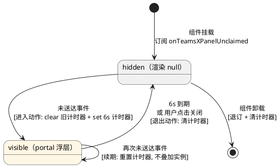
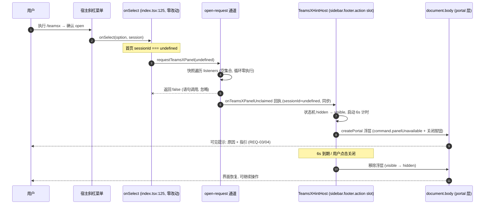
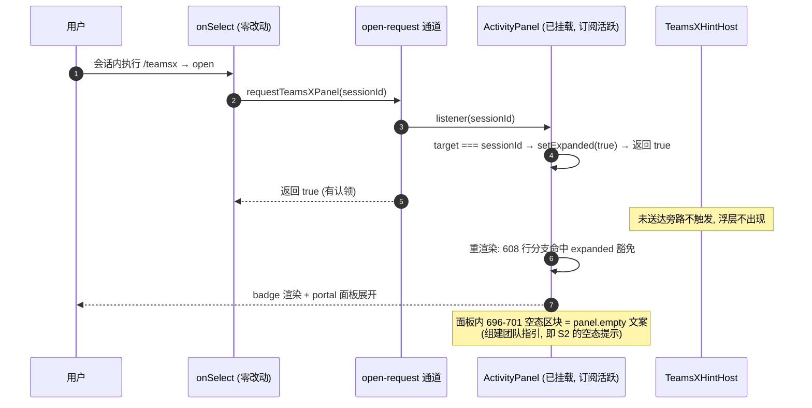

# dsh-teams-x — `/teamsx` 空态提示 实现方案设计（design.md）

> **Feature Name**: `teamsx_empty_hint`
> **文档状态**: 待评审 | **日期**: 2026-09-09
> **上游文档**: `sdd/spec.md`（REQ-01~14、非目标 O-1~O-7、验收 A1~E3、待定项 D-01~D-05）
> **代码基线**: 插件 HEAD `da7cb82` / 0.2.0 | 宿主 DeepSeek Harness 0.1.3-alpha.1（本地 checkout 已核实）
> **文档性质**: 本文档描述"怎么做"（How）。所有设计决策逐条承接 spec 需求，待定项 D-01~D-05 在第八章裁决。

---

## 一、需求与存量分析

### 1.1 spec 需求回溯表

每条 EARS 需求到设计落点的映射（设计落点的章节号见本文档）：

| 需求 | 摘要 | 设计落点 | 承接方式 |
| --- | --- | --- | --- |
| REQ-01 | 面板已挂载时正常展开 | §3.1（ack 认领语义）、§5.1 时序 | 打开请求通道的既有行为完全保留；认领返回值只是附加信号，不改展开动作 |
| REQ-02 | 面板会话隔离语义保持 | §3.1（按 sessionId 认领） | 监听器仍按 `target === sessionId` 认领，跨会话面板不认领不展开 |
| REQ-03 | 空态时呈现用户可见提示 | §2（改动清单）、§5.1 | 场景 S1（首页）→ 全局浮层提示；场景 S2（会话内无面板可见）→ 面板空态承载提示 |
| REQ-04 | 提示非静默、含指引、可消失 | §3.2（文案）、§4（状态机）、§8-D05 | 浮层含下一步指引文案，6s 自动消失 + 手动关闭；面板空态随面板生命周期关闭 |
| REQ-05 | 宿主缺 commandUi 降级链保持 | §2.1（index.tsx 零改动）、§6.1 | `registerTeamsXCommand` 双层 console.warn 结构不动；新增逻辑全部在该函数之外 |
| REQ-06 | 队友子会话不得静默 | §1.2 场景 S3、§8-D03 | 保持命令不可用（宿主过滤）为主防线；契约差异放行时落 S1/S2 可见反馈路径 |
| REQ-07 | available 谓词不回退 | §2.1（index.tsx 零改动）、§8-D03 | `available` 谓词逐字节保持现状 |
| REQ-08 | 文案 zh/en 双语、键数一致 | §3.2（locale 键） | zh 字典（键集 source of truth）与 en 字典同步 +2 键，95→97 |
| REQ-09 | 界面语言正确呈现 | §3.2、§5.1 | 文案经宿主 locale 服务的 `t` 座席下发，无键名裸露路径 |
| REQ-10 | DSH 核心包零改动 | §2.1（改动清单） | 改动全部位于插件 `src/client/**`、locales、smoke 脚本；deepseek-harness 目录零 diff |
| REQ-11 | 零新增运行时依赖 | §2.1（改动清单）、§6.1 | 无新增 dependencies；`package.json` devDependencies 新增 1 条类型-only link（不进 bundle，见 §2.1 说明） |
| REQ-12 | O(1) 优化不回退 | §2.1（改动清单） | 不触及 `src/state.ts`、`src/tools.ts`；服务端路径零改动 |
| REQ-13 | smoke 全绿 | §7.1 | 扩展 `scripts/client-smoke.mjs`，新增 ack/未送达/浮层 SSR 断言 |
| REQ-14 | 173/173 全绿 | §7.2 | 服务端路径零改动，173 用例应零失败；纳入验证门禁 |

### 1.2 空态场景模型（设计的问题定义）

spec 将"空态"定义为"不存在已挂载的 TeamsX 活动面板"。结合宿主 0.1.3-alpha.1 的实际 UI 结构，空态可精确分解为三个可触达场景——**设计必须分别覆盖**：

| 场景 | 宿主 UI 状态 | ActivityPanel 组件 | 打开请求结果 | 现状用户感知 |
| --- | --- | --- | --- | --- |
| **S1 首页空态** | `sessionId === undefined`，宿主 ConversationRoot 进入 hero phase：居中输入框（`variant='hero'`，placeholder 明示支持 `/` 指令）+ 品牌区；**无 session header** | 未挂载（`conversation.session.header.actions` slot 不渲染） | 监听器集合为空，`requestTeamsXPanel` 循环零执行 | 静默 no-op（实测问题 3） |
| **S2 会话存在但无面板可见** | 会话已打开，但该会话无 live/archive 团队数据 | 挂载于 header.actions，但 `sessionTeams.length === 0 && !hasArchived` 分支 `return null`（badge 与面板都不渲染）；**订阅仍然活跃** | 监听器被调用且 `target === sessionId` 匹配 → `setExpanded(true)` → 重渲染仍命中 `return null` 分支 | 静默 no-op（设计分析新识别，spec A4 场景） |
| **S3 队友子会话** | 宿主提供 `subagentAddress` 契约时，`available` 返回 false，命令在斜杠菜单中**被过滤不可见**（宿主 ui-commands 候选合成 `continue` 跳过） | 不适用（命令不可触达） | 不触发 | 无静默问题（语义正确）；契约缺失的宿主上命令放行，落 S1/S2 路径 |

**关键洞察（S2 的正确性漏洞）**：仅靠"监听器是否存在/认领"判定空态是不充分的——S2 中组件已挂载、订阅活跃、认领成功（`setExpanded(true)` 执行），但渲染层 `return null` 导致用户依然什么都看不到。因此空态检测信号（D-02）必须与渲染分支修正（§5.2）配套，两者缺一不可。

**S1 可达性证据**：宿主 `ui-conversation/src/client/skeleton/ConversationRoot.tsx:272` — `const hero = sessionId === undefined`；hero phase 渲染居中 InputBar 且 placeholder 为"描述你想要构建的内容… / 调用指令 @ 文件或对话"。首页可以执行 `/teamsx`，与 ACCEPTANCE-BROWSER.md 问题 3 的实测记录一致。

### 1.3 需求功能与存量功能对比

#### 1.3.1 已实现功能（本次保持不动）

| 需求功能 | 存量功能 | 代码位置 | 匹配度 |
| --- | --- | --- | --- |
| 面板展开请求通道（REQ-01/02 行为面） | `requestTeamsXPanel` 遍历监听器、`onTeamsXPanelRequest` 订阅/退订 | `src/client/open-request.ts:12-23` | 100% |
| 会话隔离（REQ-02） | ActivityPanel 订阅回调按 `target === sessionId` 展开 | `src/client/ActivityPanel.tsx:547-551` | 100% |
| 命令注册与降级链（REQ-05/07） | `registerTeamsXCommand`：嵌套 inject + 双层 try/catch console.warn；`available` 谓词 | `src/client/index.tsx:106-138` | 100% |
| 面板内空态文案（S2 提示载体，直接复用） | 展开面板的 `panel.empty` 空态区块（含组建团队指引语义） | `src/client/ActivityPanel.tsx:696-701`、`locales.ts` `panel.empty` | 100% |
| 浮层渲染技术路径（S1 提示载体，复用模式） | `createPortal(..., document.body)` + CSS Module + 宿主主题变量 | `src/client/ActivityPanel.tsx:635-707`、`ActivityPanel.module.css` | 100%（模式复用） |
| i18n 机制（REQ-08/09） | zh 字典为键集 source of truth，`TeamsXLocaleKey` 类型派生，smoke 校验 en 覆盖 zh | `src/client/locales.ts:109-113`、`scripts/client-smoke.mjs:78-87` | 100% |

#### 1.3.2 需要扩展的功能

| 需求功能 | 存量功能 | 差异说明 | 扩展方向 |
| --- | --- | --- | --- |
| 空态检测信号（D-02，REQ-03） | `requestTeamsXPanel` 返回 `void`，监听器返回 `void`，送达与否对外不可知 | 输出差异：调用方无法得知请求是否被认领；业务逻辑差异：无"未送达"下游事件 | `requestTeamsXPanel` 返回 `boolean`（是否有面板认领）；监听器签名追加认领返回值；新增"未送达"旁路通知通道。向后兼容论证见 §3.1 |
| S2 渲染分支（REQ-03/A4） | 无团队数据时无条件 `return null`，即使 `expanded === true`（命令刚显式请求展开） | 边界条件差异：显式展开请求与"无数据"组合时应呈现面板空态而非 null | 渲染条件追加 `expanded` 豁免：命令请求的展开渲染 badge + 面板（面板内既有空态文案即提示） |
| 提示文案（D-04，REQ-08） | 95 键 zh/en 字典，无命令反馈域 | 键集差异：新增 `command.*` 域 2 键 | zh/en 同步新增，键数 95→97，smoke 既有校验自动覆盖 |
| 冒烟测试（REQ-13） | 校验 bundle 加载、apply 注册、命令注册、locale 键数、面板/卡片 SSR | 覆盖差异：无通道 ack 行为与全局提示载体的断言 | 追加 open-request 单元断言、hint host slot 注册断言、浮层 SSR 断言 |

#### 1.3.3 需要新增的功能或接口

**模块：全局提示宿主（S1 场景唯一新增组件）**
- 输入：来自 open-request 通道的"未送达"事件（sessionId）；宿主 sidebar footer slot 注入的 owner props（`wide: boolean`）；locale `t` 座席。
- 输出：portal 到 `document.body` 的 fixed 定位浮层提示（含指引文案与关闭按钮）；无事件时渲染 `null`（对宿主布局零可见影响）。
- 核心逻辑：订阅未送达事件 → 显示浮层并续期；到期/手动关闭 → 隐藏；单实例去重（重复触发重置计时，不叠加）。
- 依赖：open-request 通道（§3.1）、locales（§3.2）；无 store、无第三方库。

**接口：未送达通知通道（open-request.ts 内新增）**
- 输入：`requestTeamsXPanel` 判定无任何面板认领时的同步回调。
- 输出：向订阅者（hint host）广播未送达事实（携带目标 sessionId）。
- 依赖：无（纯 Set 监听器，与既有通道同构）。

**slot 贡献：`sidebar.footer.action`（root scope，list kind）**
- 宿主 ui-sidebar 声明的唯一"常驻 + 可多贡献者"全局 slot（调研结论见 §8-D01）；插件经 `ctx.slots.inject` 挂载 hint host，作为 S1 场景下插件在宿主 UI 中的常驻 React 挂载点。

### 1.4 相关源码现状

**① 打开请求通道（`src/client/open-request.ts`，23 行，全文核实）**
- 模块级 `Set<Listener>`；`Listener = (sessionId: string) => void`。
- `requestTeamsXPanel(sessionId)` 同步快照遍历（`[...listeners]`，防遍历中增删异常）；无监听器时循环零执行——源码注释自述 "no-op when it is not mounted"。
- `onTeamsXPanelRequest` 返回退订函数。无 store 依赖，bundle 友好。
- 约束：O-2 要求不修改既有对外语义与既有调用方签名；内部增强必须向后兼容。

**② 命令注册（`src/client/index.tsx:106-138`，全文核实）**
- `registerTeamsXCommand`：外层 `ctx.inject(['commandUi'], ...)` catch → `teams-x: commandUi service missing...`；内层 catch → `teams-x: commandUi unavailable...`（REQ-05 降级链）。
- `available` 谓词（115-120 行）：`subagentAddress` 非函数 → 恒 true（契约缺失放行）；是函数 → 队友子会话返回 false（REQ-07 保护对象）。
- `ui.kind: 'popupSelect'`，`options` 单选项 `{ id: 'open', label: 'TeamsX' }`，`onSelect` 调用 `requestTeamsXPanel(session.sessionId)` 后即返回。

**③ 面板挂载链路（`src/client/ActivityPanel.tsx` + `index.tsx:55-62`）**
- 挂载点：`ctx.slots.inject('conversation.session.header.actions', () => ctx.slots.register({ name, id: 'teams-x-activity', order: 30, locale }, (props) => <ActivityPanel .../>))`——session scope，仅在打开的会话标题栏存在。
- 订阅（547-551 行）：`useEffect(() => onTeamsXPanelRequest((target) => { if (target === sessionId) setExpanded(true) }), [sessionId])`——**回调无返回值**。
- 可见性闸门（608 行）：`if (sessionTeams.length === 0 && !hasArchived && error === undefined) return null`——位于所有 hooks 之后、JSX 之前；**该分支不看 `expanded`**（S2 漏洞根源）。
- 展开渲染（630-707 行）：badge 常驻锚点 + `createPortal` 到 `document.body` 的面板；面板内 696-701 行已有空态区块（`panel.empty`）。
- 约束：组件内 useEffect 订阅模块通道是插件既有模式；样式经 CSS Module（lightningcss 哈希类名，构建期内联注入）。

**④ i18n 机制（`src/client/locales.ts` 209 行 + `locale-keys.ts`）**
- `TEAMSX_LOCALE_NAMESPACE = 'teamsX'`；zh 字典 95 键（键集 source of truth），en 字典类型为 `Record<TeamsXLocaleKey, string>`（缺键即编译错误）。
- 键命名风格：`域.子键` 点分小驼峰（`panel.*`、`team.*`、`editor.*`、`card.*`、`member.*`、`task.*`、`inbox.*`、`role.*`、`format.*`）；参数插值 `{name}`。
- 消费路径：宿主 locale 服务下发 `t` 座席 → 组件 `makeT` 包装插值。无键名裸露路径（REQ-09）。

**⑤ 构建纯净门（`tsdown.config.ts:23-74`，关键约束）**
- `CLIENT_EXTERNALS` 仅 `react`、`react/jsx-runtime`、`react-dom`、`react-dom/client`、`@deepseek-ai/cordis`。
- 自定义 plugin `teamsx-client-bundle-purity`：任何 `@deepseek-ai/` **值导入**若非 externals / inline-safe / vendored，构建期直接 throw（"cross-plugin value imports are forbidden"）。→ 宿主 `ui-primitives` 的 `Toast` 原语**无法被插件 bundle runtime 引用**（type-only 导入会被擦除，无运行时形态）。这是 D-01 选型的决定性证据之一。

**⑥ 首页 hero 结构与全局 slot 清单（宿主 0.1.3-alpha.1 调研）**
- 首页（`sessionId === undefined`）：hero phase = 品牌区 + 工作区选择行 + 居中输入框；session header 不渲染。
- 宿主全部 SlotMap 声明中，`list` kind + `root` scope（常驻、可多贡献者）的组合仅三处：`sidebar.footer.action`（侧栏底部动作区，常驻）、`settings.action` / `settings.section`（设置面板打开时才挂载，不常驻）。
- `sidebar.footer.action` owner props 仅 `{ wide: boolean }`；sidebar 为布局一级区域，首页同样渲染。
- `conversation.hero.workspace` 等 hero slot 均为 `single` kind 且已被宿主包注册——插件再声明会在加载期冲突失败，不可用。
- toast/notice 能力调研：宿主无 cordis 级统一 toast/通知服务；`ui-conversation` 的 `SessionInputShell.notices`（`InputNotice{level,text,seq}`）挂在会话输入框 shell 内部，插件 ctx 无入口，且 **S1 空态时输入框 shell 的 notice 出口不承载全局浮层**（它渲染在 composer 通知条位置，且其通知由会话输入状态机驱动，无外部注入契约）。

### 1.5 红线承接矩阵（spec 硬约束显式承接）

| 硬约束 | 承接声明 |
| --- | --- |
| REQ-10 DSH 核心包零改动 | 改动清单（§2.1）全部位于插件仓库；`deepseek-harness/` 目录零 diff；验收以 `git diff --stat deepseek-harness` 为空为准 |
| REQ-11 零新增运行时依赖 | 无新增 `dependencies`；bundle 产物仅增加插件自有浮层组件与 2 条文案，无新第三方模块；devDependencies 新增的 ui-sidebar link 为**类型-only**（import type 擦除，不进 bundle），并在 §6.1 说明其降级面 |
| REQ-12 O(1) 不回退 | 不触及 `src/state.ts`、`src/tools.ts`、服务端路由；T07-T09 性能断言（H1≤500ms、H2≤40ms）路径零改动 |
| REQ-05 降级链不破坏 | `registerTeamsXCommand` 函数体逐字不动；新增 slot 注册走独立函数，失败面被 try/catch + inject 挂起语义双重隔离（§6.1） |
| REQ-07 谓词不回退 | `available` 谓词零改动（§8-D03 维持现状决策使其自然成立） |
| REQ-13/14 测试门禁 | `pnpm smoke:client` 全绿 + 173/173；smoke 扩展不得弱化既有断言（§7） |

---

## 二、增量设计

### 2.1 核心改动清单（文件级）

| # | 文件 | 动作 | 职责与内容 | 规模预估 |
| --- | --- | --- | --- | --- |
| 1 | `src/client/open-request.ts` | 扩展 | 监听器签名追加认领返回值；`requestTeamsXPanel` 返回送达 boolean；新增未送达旁路通道（注册/退订 API） | +15 行左右 |
| 2 | `src/client/ActivityPanel.tsx` | 修改 | ① 订阅回调返回认领结果（`target === sessionId` 时展开并返回 true，否则 false）；② 608 行渲染分支追加 `expanded` 豁免（S2 修正） | ±6 行 |
| 3 | `src/client/hint-host.tsx` | **新增** | `TeamsXHintHost` 组件：订阅未送达通道，portal 渲染全局浮层提示；平时返回 null | 新文件约 70 行 |
| 4 | `src/client/hint-host.module.css` | **新增** | 浮层样式：fixed 定位、主题色变量（宿主 `--dsw-*` 别名优先 + 字面回退）、淡入淡出 | 新文件约 40 行 |
| 5 | `src/client/index.tsx` | 修改 | apply 中新增一个独立函数 `registerPanelHintHost(ctx)`：`ctx.slots.inject('sidebar.footer.action', ...)` 挂载 hint host；`registerTeamsXCommand` 与 `available` 谓词**零改动** | +12 行左右 |
| 6 | `src/client/locales.ts` | 修改 | zh/en 各 +2 键：`command.panelUnavailable`、`command.hintDismiss`（D-04 文案定稿见 §3.2） | +4 行 |
| 7 | `package.json` | 修改 | ① devDependencies 新增 `@deepseek-ai/dsh-client-ui-sidebar`（link，**类型-only**：`PropsRuntime<'sidebar.footer.action'>` 的 SlotMap 声明解析；import type 擦除后 bundle 不产生该模块请求）；② `dsh.client.inject` 列表追加同包名（informational 边，宿主 preflight 展示用） | +2 行 |
| 8 | `scripts/client-smoke.mjs` | 修改 | 扩展断言：通道 ack 行为、未送达通道注册/触发/退订、hint host slot 注册捕获、浮层 SSR 安全；zh/en 键数校验自动覆盖 97/97 | +45 行左右 |

**明确不改动**：`src/client/card-definition.tsx`、`TeamsXCardPanel.tsx`、`session-navigation.ts`、`StagedPlanEditor.tsx`、`icons.ts`、全部 `src/**`（服务端）、`tsdown.config.ts`、`tsconfig*.json`。

### 2.2 模块职责划分

```
src/client/
├── open-request.ts        [扩展] 打开请求 + 送达判定 + 未送达通知 —— 单一事实源
├── index.tsx              [微调] apply 装配：+1 个 slot 注册函数；命令注册零改动
├── ActivityPanel.tsx      [微调] 认领返回值 + S2 渲染豁免；面板功能零改动
└── hint-host.tsx          [新增] 全局浮层提示宿主（S1 载体），订阅 open-request 未送达通道
```

职责边界：
- **open-request.ts** 是"命令 → 面板"通信与"送达判定"的唯一归属。`index.tsx` 的 `onSelect` 保持原调用形态（忽略返回值），未送达通知由通道内部触发——命令注册代码因此零改动，REQ-05/07 的保护面最小化。
- **ActivityPanel.tsx** 只做两件事：如实上报认领结果；在"显式展开请求 × 无数据"组合下不再静默。不新增任何提示 UI（S2 复用面板既有空态区块）。
- **hint-host.tsx** 只服务 S1（无任何面板挂载）场景。它不感知命令、不感知面板状态，仅消费"未送达"事件——与 ActivityPanel 完全对称（一个消费"送达并认领"，一个消费"无人认领"）。

### 2.3 组件总体架构

```plantuml
@startuml
skinparam componentStyle rectangle

component "/teamsx 命令注册\n(index.tsx · 零改动)" as Cmd
component "open-request.ts\n[扩展]" as Chan
component "ActivityPanel\n(session header slot)\n[微调]" as Panel
component "TeamsXHintHost\n(sidebar.footer.action slot)\n[新增]" as Hint
component "locales.ts teamsX 命名空间\n[+2键]" as Locale

slashmenu "宿主斜杠命令菜单" as Menu
rectangle "宿主 UI" as Host {
  rectangle "会话标题栏" as Header
  rectangle "侧栏底部 (常驻)" as Sidebar
  rectangle "document.body (portal 层)" as Portal
}

Menu --> Cmd : onSelect\n(现状调用形态保持)
Cmd --> Chan : requestTeamsXPanel(sessionId)\n返回 boolean(新增)
Chan --> Panel : 遍历监听器\n认领返回 true/false
Chan --> Hint : 未送达事件\n(仅全员不认领时)
Panel --> Portal : 面板空态区块\n(panel.empty · 复用)
Panel --> Header : badge (S2 豁免渲染)
Hint --> Portal : 空态浮层提示\n(command.panelUnavailable)
Locale --> Panel : t()
Locale --> Hint : t()

Chan ..> Chan : 同步遍历(单线程原子)
@enduml
```

调用频率：`requestTeamsXPanel` 仅在用户执行 `/teamsx` 时触发（人工频率，极低）；未送达通道同频；浮层渲染事件驱动，无常驻轮询/定时器（除显示中的单个 6s 消失计时器）。

### 2.4 与宿主扩展点的关系

| 宿主扩展点 | 用途 | 失败面 |
| --- | --- | --- |
| `ctx.inject(['commandUi'])` | 命令注册（存量，不动） | 缺失 → 双层 console.warn（REQ-05） |
| `ctx.slots.inject('conversation.session.header.actions')` | 面板挂载（存量，不动） | — |
| `ctx.slots.inject('sidebar.footer.action')` | hint host 挂载（新增） | 宿主无此声明 → inject 挂起、静默不注册（能力检测降级，§6.1）；注册抛错 → try/catch console.warn，其余功能不受影响 |
| `ctx.locale.register` | 字典注册（存量，自动覆盖新键） | — |

---

## 三、接口定义

接口设计遵循三条总原则：**类型安全**（导出面全部显式类型，禁用字符串 Map 式宽接口）、**最小面**（新增导出仅 1 个订阅函数 + 1 个类型，其余为既有签名的向后兼容宽化）、**单一事实源**（送达判定与未送达通知全部收拢在 open-request.ts，命令与面板代码不感知判定细节）。

### 3.1 open-request.ts 扩展接口（D-02 裁决的实现面）

扩展后的完整导出面（签名块，省略模块头注释与内部 Set 声明）：

```typescript
/** 认领语义：监听器确认"本次打开请求由本面板处理"并已触发展开时返回 true；
 *  其余任何返回（false / void / undefined）均视为未认领。 */
export type TeamsXPanelListener = (sessionId: string | undefined) => boolean | void

/** 未送达回执监听器：requestTeamsXPanel 判定"零认领"时同步回调一次。 */
export type TeamsXPanelUnclaimedListener = (sessionId: string | undefined) => void

/** 发起面板打开请求（既有调用形态不变）。同步、纯快照遍历（遍历中增删监听器
 *  不影响本次遍历，既有语义）。返回 true 当且仅当至少一个监听器返回 true；
 *  零监听器或全部未认领 → 返回 false，并同步触发未送达旁路。 */
export function requestTeamsXPanel(sessionId: string | undefined): boolean

/** 订阅打开请求（既有 API；参数类型宽化、返回值可选）。返回退订函数（不变）。 */
export function onTeamsXPanelRequest(listener: TeamsXPanelListener): () => void

/** 【新增】订阅"未送达"回执。返回退订函数，与 onTeamsXPanelRequest 完全同构。 */
export function onTeamsXPanelUnclaimed(listener: TeamsXPanelUnclaimedListener): () => void
```

**认领语义的精确定义**（§1.3.2 扩展方向的契约化）：

| 判定项 | 规则 |
| --- | --- |
| 认领成功 | 监听器满足 `target === sessionId`（会话匹配）→ 执行 `setExpanded(true)` → 返回 `true` |
| 未认领 | `target !== sessionId` → 返回 `false`，不展开、无副作用 |
| 兼容返回 | `void` / `undefined` → 通道按未认领计（归并时以 `=== true` 严格判定） |
| 送达判定 | `claimed = 快照遍历中任一监听器返回 true`；`claimed === false` 时同步触发未送达旁路 |
| 会话隔离 | 认领与展开均由监听器内 `target === sessionId` 门槛约束 → 跨会话面板不认领不展开（REQ-02 语义原样保留） |
| 通知时序 | 未送达旁路与 `requestTeamsXPanel` 同一同步调用栈（单线程 JS、无 await），无异步竞态窗口（§6.2） |

**向后兼容论证（O-2 逐面对照）**：

| 契约面 | 既有形态 | 扩展后 | 兼容性论证 |
| --- | --- | --- | --- |
| `requestTeamsXPanel` 返回值 | `void` | `boolean` | 唯一调用方 `index.tsx:125`（`onSelect`）以语句调用忽略返回值，TS 允许且运行时展开动作仍在监听器内完成——对调用方零行为差异，`index.tsx` 因此零改动 |
| 参数 `sessionId` | `string` | `string \| undefined` | 类型完备性修正：S1 首页宿主 `session.sessionId` 即为 `undefined`（§1.2 S1），现状签名与运行时事实不符；该模块未从插件入口导出，仅 `index.tsx` / `ActivityPanel` 内部消费，宽化无外部破坏面 |
| `Listener` 返回值 | `void` | `boolean \| void` | 超集扩展：既有"无返回值"监听器在运行时被解读为未认领（`=== true` 严格判定），行为安全；插件内唯一订阅者 `ActivityPanel:548` 本次同步改造为返回认领值 |
| `onTeamsXPanelRequest` 退订函数 | `() => void` | 不变 | 无改动 |
| 新增通知通道 | — | `onTeamsXPanelUnclaimed` | 纯增量 API，不触碰任何既有符号；与既有通道同构（纯 Set 监听器，无 store 依赖） |

### 3.2 locales.ts 新键定义（D-04 文案定稿）

新增 `command.*` 域（既有键域为 `panel/team/plan/editor/card/format/member/task/inbox/role`，均为"域.子键"点分小驼峰）。主文案对齐既有 `panel.empty` 的"状态 — 指引"长破折号结构（`locales.ts:14`：`暂无团队活动 — 在会话中说"用 TeamsX 做 X"即可组建团队`）：

| 键 | zh 文案 | en 文案 | 用途 |
| --- | --- | --- | --- |
| `command.panelUnavailable` | 没有可响应的 TeamsX 面板 — 请先进入一个会话，再执行 /teamsx | No TeamsX panel is available to respond — enter a session first, then run /teamsx | S1 全局浮层主文案：原因（无可响应面板）+ 下一步指引（先进入会话），满足 REQ-04 (a)(b) |
| `command.hintDismiss` | 关闭提示 | Dismiss hint | S1 浮层关闭按钮的 `aria-label` / `title`（REQ-04 (c) 手动关闭入口的可访问性命名，风格对齐既有 `panel.close` = 关闭面板 / Close panel） |

定稿说明：

- **双语同步由类型系统保证**：zh 字典为键集 source of truth，en 字典类型为 `Record<TeamsXLocaleKey, string>`（`locales.ts:113`），缺键即编译错误（REQ-08 的结构性保障，§1.4 ④）。
- **键数 95→97**：`TeamsXLocaleKey` 联合类型自动扩 2 项；smoke 既有 en 覆盖 zh 的检查（`client-smoke.mjs:83-85`）无需修改即自动覆盖新键（REQ-13）。
- **S2 场景零新键**：S2 的提示由面板既有空态文案 `panel.empty` 承载（复用 `ActivityPanel:696-701` 区块），S1 与 S2 的提示文案各自匹配场景语义、互不混用，两键即够用（完整论证见 §8-D04）。
- **无插值参数**：两条文案均不需要 `{name}` 类插值（与 spec REQ-04 的"含指引"要求为静态语义，无需参数化）。

### 3.3 hint-host.tsx 组件接口

挂载形态与 `ActivityPanel` 的 header.actions 挂载完全同构（`index.tsx:55-62`）：插件在 slot 渲染回调中以 `{...props}` 透传宿主下发的 owner props 与 locale 座席。

```tsx
// src/client/hint-host.tsx
export interface TeamsXHintHostProps {
  /** 宿主 sidebar.footer.action owner props（宿主 SlotMap 声明仅此一项，
   *  §1.4 ⑥）：宽/窄布局信号，用于浮层在窄布局下的边距收敛。 */
  wide: boolean
  /** 宿主按 slot spec 的 locale 契约下发的翻译座席，
   *  与 ActivityPanel 的 t 同源同型（TEAMSX_LOCALE_NAMESPACE）。 */
  t: (key: TeamsXLocaleKey, params?: Record<string, string | number>) => string
}
export function TeamsXHintHost(props: TeamsXHintHostProps): ReactElement | null
```

内部状态（仅 2 项，无 store、无第三方依赖）：

| 内部状态 | 载体 | 初始值 | 语义 |
| --- | --- | --- | --- |
| `visible` | `useState<boolean>` | `false` | 浮层显隐状态机的唯一状态位（§4.1） |
| `timerRef` | `useRef<number \| undefined>` | `undefined` | 6s 自动消失计时器句柄；可见期间恰有一个 |

行为契约：

| 契约点 | 规则 |
| --- | --- |
| 订阅 | `useEffect(() => onTeamsXPanelUnclaimed(onUnclaimed), [])`——空依赖数组：通道是模块级单例、组件在 root scope 跨会话常驻，订阅生命周期与组件等长，不随会话切换重建 |
| 未送达事件处理 | `visible` 置 `true`；计时器先 clear 后 set（续期语义，§4.1）；事件携带的 `sessionId` 仅 `console.debug` 透传用于诊断（§6.2 裁决） |
| 渲染守卫 | `visible === false` 或 `document` 不可用 → 返回 `null`（SSR 安全，与 bundle 既有 document 守卫模式一致）；`visible === true` → `createPortal(浮层 DOM, document.body)`（复用 `ActivityPanel:635` 已验证的 portal 模式） |
| 手动关闭 | 按钮 `onClick` → `visible=false` + 清计时器；`aria-label` / `title` = `t('command.hintDismiss')` |
| 自动到期 | 6s 定时回调 → `visible=false`；回调经 `timerRef` 句柄与"已关闭"状态互斥，防止已手动关闭后被旧定时器再次置位 |
| 卸载清理 | `useEffect` 清理函数：退订 + 清计时器（无泄漏，§6.3） |
| 样式 | `hint-host.module.css`：fixed 定位浮层、宿主 `--dsw-*` 主题变量优先 + 字面回退（§2.1 第 4 项）、淡入淡出过渡；经 lightningcss 哈希类名构建期注入（与 `ActivityPanel.module.css` 同一构建链路） |

### 3.4 package.json 改动的确切 diff 形态

```diff
--- a/package.json
+++ b/package.json
@@ "devDependencies"（按既有字母序插入）
     "@deepseek-ai/dsh-client-ui-renderer": "link:./deepseek-harness/packages/client/ui-renderer",
+    "@deepseek-ai/dsh-client-ui-sidebar": "link:./deepseek-harness/packages/client/ui-sidebar",
     "@deepseek-ai/dsh-client-ui-session": "link:./deepseek-harness/packages/client/ui-session",
@@ "dsh"."client"."inject"（informational 边，追加到列表末尾）
         "@deepseek-ai/dsh-client-ui-renderer",
-        "@deepseek-ai/dsh-api-session-controller"
+        "@deepseek-ai/dsh-api-session-controller",
+        "@deepseek-ai/dsh-client-ui-sidebar"
       ],
```

三条注记：

1. **peerDependencies 不动**：类型-only link 只服务开发期 `PropsRuntime<'sidebar.footer.action'>` 类型解析（`import type` 在构建期被擦除，bundle 不产生该模块的运行时请求）；写入 peerDependencies 反而会引入不必要的宿主解析约束，违反 REQ-11 的最小依赖面。
2. **`dsh.client.inject` 的语义**：informational 边，供宿主 preflight 展示插件依赖的宿主包清单；追加该包名不触发任何运行时加载行为。
3. **link 路径**：按 devDependencies 既有 `ui-*` 包的目录惯例（`ui-session` → `packages/client/ui-session`）推断为 `packages/client/ui-sidebar`，实现时以宿主 checkout 实际目录名为准（§1.4 ⑥ 调研已确认该包存在并声明 `sidebar.footer.action`）。

---

## 四、数据模型/状态

本次改动不引入持久化数据与领域对象，全部状态为两处轻量运行时状态：hint host 的浮层显隐状态机（§4.1）与 open-request 通道的监听器集合及其一次请求的状态变迁（§4.2）。

### 4.1 浮层提示显示状态机



**重复触发续期语义**：`visible → visible` 自转换表示第二次未送达事件到达时不重建任何 DOM，仅重置 6s 计时器——用户显式重试 `/teamsx`（可能没读完第一次提示）时提示刷新存续时间，这是"续期"而非"去重忽略"（忽略会让重试用户看不到任何反馈，违背 REQ-06 的可见性精神），也非"叠加实例"（堆叠 toast 制造视觉噪音且需实例栈管理）。单实例由两层结构保证：插件单次 `apply` 注入单 slot 贡献者（hint host 全应用唯一挂载点），浮层是组件内单一条件渲染子树（事件只更新 state 与计时器，不创建新 DOM 实例）。

**状态机不变量**：

| 不变量 | 保证机制 |
| --- | --- |
| 单实例浮层 | 单 slot 贡献者 + 组件内单一条件渲染子树；事件驱动 setState，无实例栈 |
| 计时器唯一性 | 进入/续期动作先 `clearTimeout` 再 `setTimeout`；关闭与到期路径经 `timerRef` 句柄清理 |
| 无资源泄漏 | `useEffect` 清理函数兜底退订与清计时器；卸载后无存活计时器/订阅 |
| 事件幂等 | 重复 `visible → visible` 仅重置计时，DOM 结构不变（§6.3 并发模式论证） |
| SSR 安全 | `document` 不可用时渲染路径恒为 `null`，状态机不启动计时器（§7.1 断言 4） |

### 4.2 open-request 通道数据流（一次 `/teamsx` 触发的完整状态变迁）

| 步骤 | 主体 | 动作 | 数据与观察 |
| --- | --- | --- | --- |
| 1 | 用户 → 宿主斜杠菜单 | 执行 `/teamsx` → 确认 `open` 选项 | `available` 谓词已在菜单合成期过滤（S3 场景到不了这里） |
| 2 | `onSelect`（index.tsx:125，零改动） | `requestTeamsXPanel(session.sessionId)` | S1 时实参为 `undefined`；返回值被语句调用忽略（兼容性 §3.1） |
| 3 | 通道 | 快照遍历监听器，逐个调用并收集返回值 | 遍历中增删监听器不影响本次遍历（既有语义） |
| 4 | 通道 | 归并 `claimed = 任一返回值 === true` | **岔路口**：claimed=true 走步骤 5a，false 走步骤 5b |
| 5a | ActivityPanel | （仅 S2/正常路径）`target === sessionId` → `setExpanded(true)` → 返回 `true` | 面板展开；未送达旁路**不触发**，hint host 无感知 |
| 5b | 通道 → hint host | 同步触发未送达旁路：快照遍历 `unclaimedListeners` | hint host 状态机 `hidden → visible`（§4.1），`requestTeamsXPanel` 最终返回 `false`（被忽略） |
| 6 | hint host | portal 渲染浮层（`command.panelUnavailable` 文案 + 关闭按钮） | 用户看到含指引的提示（S1 场景 REQ-03/04 满足点） |
| 7 | hint host | 6s 到期或手动关闭 → `hidden` | 界面恢复，REQ-04 (c) 满足点 |

两个分支的观察要点：**S1 与 S2 的分岔仅发生在步骤 4 的归并判定**——S1（零监听器）与 S2（监听器认领但渲染层无产出）在通道层面命运不同（S1 走旁路、S2 被认领），这正是 §1.2 关键洞察的结构性体现：S2 的正确性不能靠通道解决，必须由渲染豁免（§5.2）补全。

---

## 五、关键算法/流程

### 5.1 S1 场景时序：首页执行 `/teamsx` → 全局浮层 → 6s 消失



时序要点：步骤 5→6 为同一同步调用栈（无宏任务/微任务间隔），提示出现不存在可观察延迟；`onSelect` 与 `registerTeamsXCommand` 全程零改动，REQ-05/07 的保护面与改动面物理隔离。

### 5.2 S2 修正流程：会话内执行 `/teamsx` → 渲染豁免 → 面板空态承载提示

S2 的修复是**双联动**（§1.2 关键洞察）：通道认领信号（改动清单 ①②的返回值部分）让"有人认领"可判定，渲染分支豁免（改动清单 ②的豁免部分）让"认领后必然可见"。二者缺一：只改渲染 → `setExpanded(true)` 不会被触发（订阅回调仍是现状形态时命令仍静默——不对，现状订阅回调本来就会 setExpanded，真正缺的是渲染豁免；只有渲染豁免没有认领返回值 → S1 无法判定零认领 → 通道无法触发旁路）。



渲染分支（`ActivityPanel:608`）的条件对照表：

| 条件组合 | 旧行为 | 新行为 |
| --- | --- | --- |
| `sessionTeams.length === 0 && !hasArchived && error === undefined && !expanded` | `return null` | `return null`（不变——无命令请求时维持零可见影响） |
| 同上且 `expanded === true`（命令刚显式请求展开） | `return null`（S2 漏洞：认领成功但用户看不到） | 渲染 badge + portal 面板；面板内既有 `panel.empty` 空态区块即提示（A4 满足点） |
| `hasArchived` / `error !== undefined` / `sessionTeams.length > 0` | 既有渲染路径 | 不变（豁免条件是追加项，不改变既有分支的触发顺序） |

**豁免粘性行为说明**：`expanded` 置位后，用户经外点/Esc（既有 579-603 行收起交互）将 `expanded` 置 `false` 时，badge 仍常驻渲染（不再回落到 `return null`），可点击 badge 再次展开。该行为与既有 `hasArchived` 场景的 badge 常驻语义一致（`ActivityPanel:553-554` 注释："show the badge so the user can browse history"）——badge 常驻表示"该会话存在可查看的 TeamsX 状态"，命令显式请求过展开即属于此类状态；无需额外状态位做"仅首次豁免"（复杂度高且无行为收益）。badge 计数为 0 时与空态面板观感自洽。

### 5.3 正常路径回归：面板已挂载且有数据（REQ-01/02，US-2）

| 环节 | 现状 | 改造后 | 可见差异 |
| --- | --- | --- | --- |
| `onSelect` 调用 | `requestTeamsXPanel(session.sessionId)`，忽略返回值 | 完全相同（§3.1 兼容论证） | 无 |
| 通道遍历 | 同步快照遍历 | 相同 + 归并认领值（附加信号） | 无（展开动作仍由监听器执行） |
| ActivityPanel 订阅回调 | `setExpanded(true)` | `setExpanded(true)` + `return true` | 无（返回值只是通道归并输入） |
| 渲染 | 有数据走既有渲染路径 | 豁免条件为追加项，有数据分支先于豁免判定短路，路径不变 | 无 |
| 未送达旁路 | （不存在） | `claimed === true` 不触发 | hint host 无感知，无浮层 |

结论：正常路径的每一环节要么逐字节保持、要么仅附加"返回值/归并"信号，用户可见行为与改造前完全一致（B1/B2 回归保障的结构性依据；自动化验证见 §7.2/§7.3-E2）。

---

## 六、错误处理与降级

降级设计的总原则与插件既有哲学一致（`index.tsx` 文件头注释："Every conversation/command touchpoint is feature-detected and try-caught"）：**每个新增触点独立隔离，任何单点失败最多损失本功能，绝不波及命令/面板/卡片/字典等其他功能，且降级终态不劣于改造前现状**。

### 6.1 宿主扩展点与依赖缺失的降级

#### 6.1.1 宿主无 `sidebar.footer.action` slot 声明 → inject 挂起语义

**机制**：`ctx.slots.inject(slotName, registerFn)` 对宿主 SlotMap 未声明的 slot 名不具备注册目标——调用被挂起，`registerFn` 回调不会执行，无报错、无日志（cordis 依赖注入对缺失目标的挂起语义）。hint host 因此**静默不注册**，插件其余部分（命令/面板/卡片/字典）完全无感。

**对 S1 场景的实际影响面**：hint host 不挂载 → `onTeamsXPanelUnclaimed` 通道无消费者 → S1 空态执行 `/teamsx` 时未送达事件无人接 → **提示退化为不可见，即回到改造前的静默现状**。S2 路径**不受任何影响**（渲染豁免与 `panel.empty` 空态承载完全在 ActivityPanel 内部，不依赖 hint host 的存在）；S3 路径不受影响（本就不依赖 hint host）。

**可接受性论证**：(1) 该降级仅在宿主版本早于 0.1.3-alpha.1、或宿主未来移除该 slot 声明时出现——而 REQ-03 的验收环境即 0.1.3-alpha.1（存在该 slot，§1.4 ⑥）；(2) 降级终态 = 现状行为，无负迁移（REQ-03 在该环境本就无法达成，因为宿主连命令 UI 挂载面都缺失）；(3) 与 REQ-05 的既有哲学一致——能力缺失 → 静默降级、不制造新副作用，本设计不为此引入探测宿主 SlotMap 声明表的 hack（那才是真正的侵入）。

#### 6.1.2 hint host 注册抛错 → try/catch 隔离

`registerPanelHintHost(ctx)` 整体包裹 try/catch：任何异常（slot spec 形态漂移、宿主 register 契约变化等）→ `console.warn('teams-x: hint host registration failed; the empty-state hint is disabled', error)` 后返回。隔离性与既有 `registerTeamsXCommand` 的双层 try/catch 模式同构（`index.tsx:107-137`）：**REQ-05 降级链不破坏的结构性依据**——`registerTeamsXCommand` 函数体逐字不动，新增注册走独立函数、独立 try/catch；宿主缺 commandUi 时命令不注册 → `onSelect` 不可触达 → 通道与浮层零激活 → REQ-05 验收条件"不出现本任务新增的提示逻辑副作用"自然成立，无需任何专门代码。apply 内部各注册函数的调用顺序（字典 → 面板 slot → 卡片 → 命令 → 新增 hint host）中任一环节失败都不阻断后续环节。

#### 6.1.3 类型-only link 缺失（REQ-11 的降级面说明）

**失效场景**：`pnpm install` 时 link 目标目录不存在（宿主 checkout 缺失/包目录改名）→ 依赖解析失败或产生 broken link → `import type { PropsRuntime }` 解析失败 → `pnpm typecheck` 报错（构建前被拦截，不会带病上线）。

**最小恢复路径**（约 2 行改动，纯开发期）：从 devDependencies 移除该条目，并将 `hint-host.tsx` 中相关类型标注回退为本地结构类型（`{ wide: boolean }` 的内联标注）——运行时行为零变化（`import type` 本就被擦除）、bundle 零变化、用户可见面零变化。

**宿主 preflight 行为**：`dsh.client.inject` 中不可解析的包名至多产生 preflight 警告（informational 边，§3.4 注记 2），不阻断插件加载。

**结论**：该依赖的失效面 = 开发体验（类型提示退化为结构标注），属可接受的低价值风险点；其对 REQ-11 的影响为零（无运行时依赖、无 bundle 体积变化）。

### 6.2 多会话竞态与未送达事件 sessionId 语义（设计裁决）

**事实基础**：hint host 挂载于 root scope，跨会话常驻、全应用单实例；未送达事件携带 `sessionId: string | undefined`（S1 首页为 `undefined`）。可触达的旁路触发点分析：S2 中命令与面板同处一个会话上下文、认领必然成功（不走旁路）；"有会话但监听器全部不认领"要求命令发起会话与所有挂载面板的会话错位——现状宿主的命令锚定当前会话，该场景不可触达。**S1 是唯一现实触发点**。

**竞态窗口分析**：`onSelect → requestTeamsXPanel → 未送达回执 → hint host setState` 是同一同步调用栈（单线程 JS，无 await 介入），不存在"事件到达 hint host 时用户已切换会话"的异步竞态；浮层是 fixed 定位的全局覆盖层，不锚定任何会话 UI 元素，会话切换不影响其显示/消失语义。

**设计裁决——浮层文案不区分场景**：事件携带的 `sessionId` 不用于过滤显示、不用于文案分支，仅由 hint host `console.debug` 透传用于诊断，保留给未来扩展（如按会话定位指引）。理由：(1) 若按 `sessionId` 区分"无会话/有会话但无面板"，需两套文案，但两条路径的下一步指引完全相同（先进入会话 → 再用 /teamsx），拆分徒增键数与维护面；(2) "有会话但不认领"在现状宿主下不可触达（§6.2 事实基础），为不可达场景维护文案违背 YAGNI；(3) 单一通用文案"没有可响应的 TeamsX 面板"对 S1 精确、对任何潜在错位场景不失真（REQ-09 无键名裸露路径不受影响）。该裁决与 §8-D04 的"两键即够"结论互为支撑。

### 6.3 React 并发模式（useEffect 双调用）下的幂等性保证

React 18 并发特性/StrictMode 下 effect 可能经历"建立 → 清理 → 再建立"，逐项保证：

| 关注点 | 幂等性保证 |
| --- | --- |
| 订阅双建立 | 每次建立返回的闭包引用不同，但第一次的清理函数先于第二次建立执行（React 保证 cleanup → setup 顺序），Set 中同一时刻至多一个 hint host 订阅者；即便极端时序下短暂双订阅，未送达事件也只触发一次显隐置位 + 一次计时重置，无可见差异 |
| 计时器双置 | 进入/续期动作固定为"先 clear 旧句柄再 set 新句柄"，双调用结果与单调用一致（后一个句柄生效）；清理路径经 `timerRef` 与状态互斥，无双触发 |
| 渲染幂等 | `visible → visible` 重复置位不改变 DOM 结构（同一条件渲染子树重渲染，React diff 为空操作）；portal 目标 `document.body` 稳定 |
| 会话无关性 | 订阅 effect 空依赖数组（§3.3），不存在随 `sessionId` 变化的重建/重订阅路径，从源头消除了"effect 依赖会话状态"类竞态 |
| ActivityPanel 侧 | 订阅回调改为返回认领值是纯函数增强，双调用下 `setExpanded(true)` 幂等（同值 setState 不触发额外渲染） |

smoke 的 SSR 安全断言（§7.1 断言组 4）覆盖 `document` 缺失路径的渲染安全；动态行为（双调用、计时器）由 §7.4 手工清单 V7 与宿主开发模式（StrictMode 行为可观察）兜底验证。

---

## 七、测试策略

### 7.1 scripts/client-smoke.mjs 扩展点明细（+45 行左右）

扩展完全贴合脚本既有结构：mock ctx 的捕获数组（`registered.slots` 等，`client-smoke.mjs:61`）、bundle 后直接 `import('../lib/client/*.js')` 的单元断言先例（`:121`）、`renderToString` SSR 断言先例（`:123`）、`globalThis.document = undefined` 的 pre-DOM 环境（`:28`）。

| # | 断言组 | 机制与预期 | 对应验收 |
| --- | --- | --- | --- |
| 1 | 通道 ack 单元断言 | `import('../lib/client/open-request.js')` 后：注册测试监听器——返回 `true` → `requestTeamsXPanel` 得 `true`；监听器改为返回 `undefined` → 得 `false`（兼容路径 §3.1）；退订全部监听器 → 得 `false`（零监听器）。**断言前后显式退订，保证通道状态归零**，不污染后续断言 | B1（认领语义结构性验证） |
| 2 | 未送达通道断言 | 沿用组 1 的监听器管理：零认领态执行请求 → `onTeamsXPanelUnclaimed` 订阅者收到恰一次回执且 `sessionId` 透传一致；注册一个返回 `true` 的认领监听器后再执行 → 回执**不**触发；退订未送达订阅者后再执行 → 不触发。同理保证状态归零 | A1（S1 检测信号链路）、§3.1 |
| 3 | hint host slot 注册捕获 | `plugin.apply(mockCtx)` 后：`registered.slots` 同时包含 `'sidebar.footer.action'`（inject 层捕获）与 `'register:sidebar.footer.action'`（register 层捕获）；比对 register 捕获到的 slot spec：`name === 'sidebar.footer.action'`、`locale === 'teamsX'`；捕获组件引用供断言组 4 使用 | A1（S1 载体挂载）、C1（commandUi mock 缺失不影响 hint host 注册） |
| 4 | 浮层 SSR 安全断言 | 当前 smoke 环境即 `document === undefined`：`renderToString(<TeamsXHintHost wide={false} t={...}/>)` 返回空串、不抛异常（document 守卫路径恒渲染 null，与 ActivityPanel 既有 SSR 断言 `:123-132` 同模式） | REQ-04（无渲染崩溃）、§6.3 |
| 5 | zh/en 97/97 键数校验 | mock `locale.register` 的既有 en 覆盖 zh 检查（`:83-85`）**零修改自动覆盖**新键；顺带显式断言 `zh` 键数 `=== 97`（防御意外删键回归） | D2、E1 |

**测试边界（诚实声明）**：smoke 运行于 node + `renderToString`（无 jsdom、无计时器推进），浮层状态机的**动态行为**（6s 到期、手动关闭、重复触发续期）不在 smoke 可判定范围内——该面由 §7.4 真实宿主手工清单兜底。smoke 的职责边界 = 静态可判定面（通道语义、注册捕获、SSR 安全、键数），不弱化任何既有断言（REQ-13）。

### 7.2 回归门禁链

| 顺序 | 步骤 | 门禁意义 | 本改动相关面 |
| --- | --- | --- | --- |
| 1 | `pnpm typecheck` | 双 tsconfig 全量类型检查；en 字典缺新键、`PropsRuntime<'sidebar.footer.action'>` 解析、认领返回值类型在此拦截 | §3.1/§3.2/§3.4 |
| 2 | `pnpm build` | `teamsx-client-bundle-purity` 门禁重跑——本改动零新增 `@deepseek-ai/` 值导入，应零告警；产物含 hint-host 组件与 2 条文案 | REQ-10/11 |
| 3 | `pnpm smoke:client` | §7.1 断言组 1-5 全绿，输出 `PASS (load + apply + render)` | REQ-13、E1 |
| 4 | `node scripts/full-functional-test.mjs` | **173/173** 全绿（服务端路径零改动 → 应零失败零跳过）；内含 T07-T09 性能断言（H1≤500ms、H2≤40ms），指标应与基线同量级 | REQ-14、E2、E3 |
| 5 | `git diff --stat deepseek-harness` | 输出为空（核心包零改动） | C2、REQ-10 |
| 6 | `package.json` 审查 | `dependencies` 零新增条目；bundle 产物体积对比无异常增长 | C3、REQ-11 |

### 7.3 验收标准映射表（spec A1~E3 全覆盖）

| 验收 | 覆盖方式 | 落点 |
| --- | --- | --- |
| A1 首页空态执行 `/teamsx` 出现可见提示 | smoke 断言组 2（未送达链路）+ 组 3（载体挂载）+ 手工 V1 | §7.1 / §7.4 |
| A2 提示含下一步指引 | D-04 文案定稿含指引语义（评审项）+ smoke 组 5 键存在性 | §3.2 / §7.1 |
| A3 提示可自动消失或手动关闭 | D-05 状态机裁决（6s + 关闭按钮）+ 手工 V2/V3 | §4.1 / §7.4 |
| A4 会话存在但面板未挂载同样触发提示 | S2 双联动：认领信号 + 渲染豁免；smoke 组 1（认领语义）+ 手工 V4 | §5.2 / §7.4 |
| B1 活跃会话面板正常展开 | §5.3 回归对照 + smoke 组 1（认领 true 路径）+ full-functional 173 + 手工 V5 | §5.3 / §7.2 |
| B2 多会话仅当前面板响应 | 认领的 `target === sessionId` 门槛原样保留（§3.1）+ 手工 V6 | §3.1 / §7.4 |
| B3 队友子会话判定一致且不静默 | `available` 谓词零改动（diff 审查）+ D-03 兜底路径（放行即落 S1/S2 反馈） | §8-D03 |
| C1 宿主缺 commandUi 照旧降级 | `registerTeamsXCommand` 函数体逐字不动 + smoke mock 无 commandUi 时 hint host 仍注册成功（组 3）+ 手工 V7 | §6.1.2 / §7.1 |
| C2 核心包 diff 为零 | 门禁链第 5 步 `git diff --stat deepseek-harness` 为空 | §7.2 |
| C3 无新增运行时依赖 | 门禁链第 6 步 package.json 审查 + bundle 体积对比 | §7.2 |
| D1 zh/en 界面各显其文案，无键名裸露 | `t` 座席消费路径无裸露路径（§1.4 ④）+ 手工 V8 双语言切换 | §3.2 / §7.4 |
| D2 zh/en 新键同步、键数一致 | en 字典类型缺键即编译错误 + smoke 组 5（97/97） | §7.1 |
| E1 smoke 全绿 | 门禁链第 3 步 | §7.2 |
| E2 173/173 全绿 | 门禁链第 4 步 | §7.2 |
| E3 O(1) 性能断言不回退 | T07-T09 路径零改动（`src/state.ts`、`src/tools.ts`、服务端均不在改动清单）+ 门禁链第 4 步复测 | §2.1 / §7.2 |

### 7.4 真实宿主手工验证清单（呼应 ACCEPTANCE-BROWSER.md 问题 3 的验证路径）

在 0.1.3-alpha.1 宿主 + `pnpm build` 产物加载插件的浏览器环境执行；V1 即问题 3 原记录路径（宿主首页 → `/teamsx` → 观察反馈）的复测：

| # | 前置环境 | 操作 | 预期 | 呼应验收 |
| --- | --- | --- | --- | --- |
| V1 | 宿主首页（无活跃会话） | 执行 `/teamsx` → 确认 open | 浮层提示出现：含"没有可响应的 TeamsX 面板 — 请先进入一个会话，再执行 /teamsx"文案；约 6s 自动消失 | A1/A2 |
| V2 | 同 V1 | 浮层显示中点击关闭按钮 | 浮层立即消失，界面可继续操作 | A3 |
| V3 | 同 V1 | 浮层显示中立即再次执行 `/teamsx` | 浮层不叠加，仅文案刷新、计时重置（续期） | A3、§4.1 |
| V4 | 进入一个无团队数据的会话（`panel.empty` 场景前置） | 执行 `/teamsx` → open | badge 出现 + 面板展开，面板内显示 `panel.empty` 空态文案；无全局浮层（认领成功不走旁路） | A4 |
| V5 | 进入已有 live 团队的会话 | 执行 `/teamsx` → open | 面板展开、数据正常加载，行为与改造前一致；无浮层 | B1 |
| V6 | 两个会话（A 有团队、B 无）交替 | 在会话 A 执行 `/teamsx` | 仅会话 A 面板展开；切到 B 界面无变化 | B2 |
| V7 | 宿主 dev/StrictMode 环境 + 重复 V1 | 观察 console 与计时行为 | 无重复订阅/计时器泄漏迹象；无未捕获异常 | §6.3 |
| V8 | 宿主界面语言切换 zh ↔ en | 分别执行 V1 | zh 界面显示中文文案、en 界面显示英文文案，无键名裸露 | D1 |
| V9 | 构造无 commandUi 的宿主环境（能力探测降级） | 加载插件并观察 console | 双层 console.warn 照旧、命令不可用；无新增副作用 | C1 |
| V10 | 队友子会话上下文（宿主提供 `subagentAddress`） | 查看斜杠菜单 | `/teamsx` 被过滤不可见（与改造前一致） | B3 |

---

## 八、矛盾裁决（D-01~D-05）

每项裁决遵循统一结构：问题重述 → 备选方案对比（评估维度：改动量 / 风险 / 用户体验 / 约束符合性）→ 最终裁决 → 理由 → 对 spec 需求的映射。

### 8.1 D-01：提示 UI 形态与挂载点

**问题重述**：提示以何种形态呈现（toast / 内联 / banner / 宿主通知）？宿主是否提供统一 toast 或 notice 契约？（spec 表 7-D-01）

**备选方案对比**：

| 维度 | 方案 A：插件自绘全局浮层（portal 到 document.body，挂载于 `sidebar.footer.action`） | 方案 B：宿主 `ui-primitives` 的 Toast 原语 | 方案 C：hero slot 注入 / 复用会话输入框 notice | 方案 D：仅 console.warn |
| --- | --- | --- | --- | --- |
| 改动量 | 新增组件 + 样式约 110 行 + 1 个 slot 注册函数（§2.1 ③④⑤） | 理论上最小（若契约存在） | hero slot 需插件声明贡献；notice 需宿主新契约 | 零 |
| 风险 | 低：portal + CSS Module + 主题变量是插件已验证模式（`ActivityPanel:635-707` 同款）；失败面被 §6.1 双重隔离 | **构建期直接失败**：`teamsx-client-bundle-purity` 禁止任何 `@deepseek-ai/` 值导入（`tsdown.config.ts:23-74`），Toast 无法进入 runtime（type-only 导入无运行时形态，§1.4 ⑤） | hero slots 均为 `single` kind 且已被宿主包注册——插件再声明加载期冲突失败（§1.4 ⑥）；`SessionInputShell.notices` 无插件入口、由会话输入状态机驱动、非全局浮层 | REQ-04 (a) 明确禁止 |
| 用户体验 | 全局可见、含指引、可关闭、不遮挡操作 | 不可达 | 不可达 / 非全局 | 完全不可见 |
| 约束符合性 | REQ-03/04/10/11 全部满足 | 违反构建纯净门禁 | 技术不可行 | 违反 REQ-04 (a) |

**最终裁决**：方案 A。挂载点选定宿主唯一"常驻 + list kind + root scope"的 slot——`sidebar.footer.action`（owner props 仅 `{wide: boolean}`，§1.4 ⑥ 调研结论）；S1 场景由浮层承载，S2 场景复用面板既有 `panel.empty` 空态区块，S3 场景维持宿主过滤（分工见 §1.2）。

**理由**：选型的决定性证据链是排除法——(1) 方案 B 被构建门禁一票否决（技术不可达，非权衡取舍）；(2) 方案 C 的两条路径分别因 single-kind 冲突与契约缺失不可行；(3) 方案 D 违反需求底线；(4) 方案 A 是唯一可行路径且完全复用既有模式，风险面已被 §6.1 的降级论证收敛到"最坏退化为现状"。

**spec 映射**：REQ-03（呈现载体）、REQ-04 (a)（UI 呈现非 console）、REQ-10（零核心包改动）、REQ-11（零运行时依赖——自绘仅用 React + CSS Module）。

### 8.2 D-02：空态检测信号

**问题重述**：如何可靠判定"打开请求无法到达任何已挂载的面板"？（spec 表 7-D-02）

**备选方案对比**：

| 维度 | 方案 A：通道 ack 返回值 + 未送达旁路 | 方案 B：面板挂载注册表（挂载上报 / 卸载注销的全局单例） | 方案 C：查询宿主会话/面板状态契约 |
| --- | --- | --- | --- |
| 改动量 | +15 行，全部内聚于 open-request.ts（§2.1 ①） | 新增 registry 模块 + ActivityPanel 挂载/卸载上报逻辑 + 跨组件耦合 | 需宿主提供状态查询 API |
| 风险 | 低：向后兼容（§3.1 逐面论证）；同步语义无竞态 | 中：注册表与 React 生命周期同步存在 StrictMode 双挂载去重、卸载时序等经典陷阱；且引入全局可变单例 | 不可行：宿主无该契约（§1.4 ⑥ 调研） |
| 用户体验 | S1 浮层 + S2 面板空态，全场景正确（配合渲染豁免） | **S2 依旧静默（致命缺陷）**：S2 中组件已挂载、注册表有记录 → 判定"有面板" → 不提示，但渲染层 `return null` 用户依然什么都看不到 | 不可达 |
| 约束符合性 | O-2 向后兼容 ✓；通道语义零破坏 | 新增全局状态，语义复杂度高 | — |

**最终裁决**：方案 A，且**必须与渲染分支豁免配套**（改动清单 ①②缺一不可）。

**理由**：关键洞察在于检测信号的天花板——任何基于"组件挂载/订阅活跃/监听器存在"的信号（含方案 B）都只能证明"组件在树中"，不能证明"用户可见"；S2 恰恰是"挂载但不可见"（渲染 `return null`）。因此可见性问题必须拆成两半：ack 信号解决"谁认领了请求"（通道层），`expanded` 渲染豁免解决"认领后必然可见"（渲染层）。方案 B 即便实现无误也无法修复 S2，反而是方案 A 中"未送达旁路"的判定天然正确（S2 认领成功 → 不触发浮层 → 由渲染豁免接管提示）。

**spec 映射**：REQ-03（检测手段）、REQ-04（实现正确性）、A4；O-2 的向后兼容边界在 §3.1 逐面论证。

### 8.3 D-03：队友子会话策略

**问题重述**：保持命令不可用（现状 `available=false` 路径），还是允许执行并给出与空态一致的提示？（spec 表 7-D-03，REQ-06 的具体形态）

**备选方案对比**：

| 维度 | 方案 A：保持 `available=false` 现状为主防线 | 方案 B：放开谓词，允许执行并提示 |
| --- | --- | --- |
| 改动量 | 零（谓词逐字节不动） | 修改 `available` 谓词 + 相关测试适配 |
| 风险 | 低 | **直接违反 REQ-07**（"本次改动不得收窄或破坏该行为"——放开属于行为变更）；队友子会话自身无队长面板，放开后执行必然落入空态提示，等于"允许一个注定得到空态结果的操作"，制造持续性噪音 |
| 用户体验 | 命令在子会话斜杠菜单中被宿主过滤不可见（ui-commands 候选合成 `continue` 跳过，§1.2 S3）——用户没有可失败的操作入口，无挫败感 | 子会话中可执行但永远得到提示，操作预期落空 |
| 约束符合性 | REQ-07 ✓；REQ-06 经兜底路径保障 ✓ | 违反 REQ-07 |

**最终裁决**：方案 A 为主防线；REQ-06 的"不得静默"保障由**兜底路径**实现——若未来策略调整或契约缺失的宿主放行（`subagentAddress` 非函数时谓词恒 true），命令落入正常注册路径，其空态结果自然走 S1/S2 反馈路径（浮层或面板空态），与主场景同等质量。

**理由**：REQ-06 的本质要求是"执行产生用户可见结果"，而非"必须允许执行"——本设计让"任何放行后的执行"自动获得可见反馈（这是通道 + 浮层架构的免费副产品，无需为子会话写任何专门代码），同时保持谓词现状满足 REQ-07 的硬性红线。在子会话场景中，宿主过滤是比提示更好的 UX（从源头消除无效操作），spec 也将其列为该场景语义正确的现状（§1.2 S3）。

**spec 映射**：REQ-06（经兜底路径满足）、REQ-07（谓词零改动自然成立）、B3；与 §1.2 场景 S3 定义一致。

### 8.4 D-04：提示文案定稿

**问题重述**：zh/en 具体措辞定稿（spec 仅约束"含指引、非静默"）。

**备选文案对比**（en 同构对照，此处以 zh 展示）：

| 候选 | 文案 | 评估 |
| --- | --- | --- |
| 候选 1（**定稿**） | 没有可响应的 TeamsX 面板 — 请先进入一个会话，再执行 /teamsx | 原因 + 指引齐备；长破折号"状态 — 指引"结构与既有 `panel.empty` 完全同构；一行内可读（适配浮层 6s 生命周期） |
| 候选 2 | TeamsX 面板未能打开：当前没有已挂载的活动面板。请先进入一个会话后再使用 /teamsx 命令。 | 信息更全但冗长——"已挂载的活动面板"是实现术语泄漏到用户文案；冒号 + 两句结构与既有文案风格不一致 |
| 候选 3 | 请先进入一个会话再使用 /teamsx | 只有指引没有原因，用户无法理解"为什么刚才没反应"，削弱 REQ-03 "说明面板未能打开及原因"的要求 |

**最终裁决**：候选 1 定稿，两键落位见 §3.2（`command.panelUnavailable` + `command.hintDismiss`）。

**理由**：(1) 结构对齐——复用 `panel.empty` 的"状态 — 指引"长破折号惯例，用户在面板空态与浮层提示间获得一致的文案语感；(2) 措辞用户导向——"没有可响应的面板"陈述可观察事实，不泄漏"挂载"等实现术语；(3) 指引可操作——"先进入一个会话，再执行 /teamsx"给出确切下一步，满足 REQ-04 (b)；(4) 键数经济——S2 复用 `panel.empty`（其语义"暂无团队活动 — 在会话中说'用 TeamsX 做 X'即可组建团队"本身就是该场景的正确指引），全局仅 +2 键，95→97；(5) 关闭按钮命名 `command.hintDismiss` 对齐 `panel.close` 的可访问性命名惯例。

**spec 映射**：REQ-04 (b)（指引）、REQ-08/REQ-09（双语 + 键数一致）、D1/D2。

### 8.5 D-05：提示生命周期细节

**问题重述**：自动消失时长、手动关闭入口、重复触发的去重/续期策略（依赖 D-01 形态）。

**备选方案对比**：

| 维度 | 方案 A：6s 自动消失 + 手动关闭按钮 + 重复触发续期 | 方案 B：不自动消失，仅手动关闭 | 方案 C：仅自动消失（4s），无手动关闭 | 方案 D：叠加式多实例 toast |
| --- | --- | --- | --- | --- |
| 改动量 | 低（单计时器 + 单状态位） | 低 | 低 | 高（实例栈管理 + 层叠布局） |
| 风险 | 低（§6.3 幂等论证） | 违反 REQ-04 (c)——用户不关闭则永久遮挡 | 阅读慢的用户被强制抢关，指引信息可能丢失 | 视觉噪音；多次重试时堆叠失控 |
| 用户体验 | 阅读时间充裕、可立即关闭继续操作、重试反馈正确 | 打断操作流 | 信息可能未读完即消失 | 干扰 |
| 约束符合性 | REQ-04 (c) 全满足 | 违反 REQ-04 (c) "自动消失**或**可被用户关闭"的完整意图（无自动路径） | 部分（缺手动入口） | 过度设计 |

**最终裁决**：方案 A——6s 自动消失 + 手动关闭入口（`aria-label = command.hintDismiss`）+ 重复触发重置计时（续期，不叠加实例）。状态机与不变量见 §4.1。

**理由**：(1) 提示属辅助性质（非错误告警），文案一行可读（§8-D04 候选 1），6s 给足阅读时间且不形成持续遮挡；(2) 手动关闭兜底"已理解、想立即继续操作"的用户，双通道满足 REQ-04 (c) 的"自动消失或可被用户关闭"；(3) 时长取 6s 而非 4s/10s——4s 对含指引的两段式文案偏紧，10s 对辅助性提示偏重；(4) 续期优于去重忽略（忽略会让重试用户得不到任何反馈，违背 REQ-06 可见性精神）也优于叠加（噪音），且实现上仅是"重置计时"一个动作。

**spec 映射**：REQ-04 (c)、A3、§4.1 状态机。

### 8.6 裁决汇总

| 待定项 | 一句话结论 | 详细论证 |
| --- | --- | --- |
| D-01 | 插件自绘全局浮层（portal 到 body，挂载宿主唯一常驻 `sidebar.footer.action` slot）；S1 浮层 / S2 复用面板空态 | §8.1 |
| D-02 | 通道 ack 认领返回值 + 未送达旁路，与 `expanded` 渲染豁免双联动缺一不可 | §8.2 |
| D-03 | 保持 `available=false` 现状为主防线；契约缺失放行时自然落 S1/S2 可见反馈路径 | §8.3 |
| D-04 | `command.panelUnavailable`：没有可响应的 TeamsX 面板 — 请先进入一个会话，再执行 /teamsx（en 同构）；`command.hintDismiss`：关闭提示 / Dismiss hint | §8.4 |
| D-05 | 6s 自动消失 + 手动关闭 + 重复触发重置计时（续期不叠加） | §8.5 |