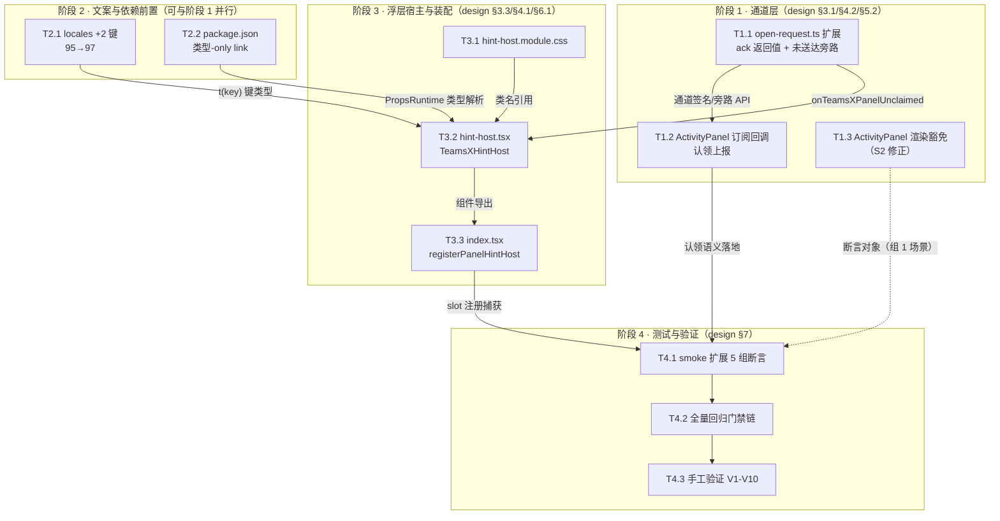

# dsh-teams-x — `/teamsx` 空态提示 编码任务分解（tasks.md）

> **Feature Name**: `teamsx_empty_hint`
> **文档状态**: 待评审 | **日期**: 2026-09-09
> **上游文档**: `sdd/spec.md`（REQ-01~14、O-1~O-7、A1~E3）、`sdd/design.md`（八章，含 D-01~D-05 裁决）
> **代码基线**: 插件 HEAD `da7cb82` / 0.2.0 | 宿主 DeepSeek Harness 0.1.3-alpha.1
> **文档性质**: 本文档描述"按什么顺序做、每步做到什么程度"。所有实现细节以 design.md 为准，任务不得偏离其设计决策。

---

## 0. 总览

### 0.1 阶段分组与任务清单

| 阶段 | 任务组 | 子任务 | 涉及文件 | 预估规模 |
| --- | --- | --- | --- | --- |
| 阶段 1 | 打开请求通道扩展与面板认领改造（design 改动清单 ①②） | T1.1 通道 ack 返回值与未送达旁路 | `src/client/open-request.ts` | +15 行 |
| | | T1.2 ActivityPanel 订阅回调认领上报 | `src/client/ActivityPanel.tsx:547-551` | +2 行 |
| | | T1.3 ActivityPanel 渲染分支 `expanded` 豁免（S2 修正） | `src/client/ActivityPanel.tsx:608` | ±2 行 |
| 阶段 2 | 文案定稿与类型依赖前置（改动清单 ⑥⑦，T3.2 的编译前提） | T2.1 locales 新增 `command.*` 2 键 | `src/client/locales.ts` | +4 行 |
| | | T2.2 package.json 类型-only link 与 inject 清单 | `package.json` | +2 行 |
| 阶段 3 | S1 浮层提示宿主与装配（改动清单 ③④⑤） | T3.1 浮层样式表 | `src/client/hint-host.module.css`（新增） | 约 40 行 |
| | | T3.2 TeamsXHintHost 组件 | `src/client/hint-host.tsx`（新增） | 约 70 行 |
| | | T3.3 index.tsx 装配 `registerPanelHintHost` | `src/client/index.tsx` | +12 行 |
| 阶段 4 | 测试扩展与全量验证（改动清单 ⑧ + design §7 门禁链） | T4.1 smoke 扩展 5 组断言 | `scripts/client-smoke.mjs` | +45 行 |
| | | T4.2 全量回归门禁链 | 无新改动（验证型任务） | 0 行 |
| | | T4.3 真实宿主手工验证清单 | 无新改动（验证型任务） | 0 行 |

**预估总规模**：约 **194 行**（新增约 185 行 + 修改约 9 行），全部位于插件仓库 `src/client/**`、`locales.ts`、`package.json`、`scripts/client-smoke.mjs`，DSH 核心包零 diff。

### 0.2 任务 ↔ 需求覆盖矩阵

每个任务承接的 spec 需求（REQ）与验收标准（A~E）映射；"核查"类任务负责最终确认。

| 需求/验收 | 实现任务 | 核查任务 |
| --- | --- | --- |
| REQ-01 面板已挂载正常展开 / B1 | T1.1（认领语义保持展开动作）、T1.2 | T4.1 组 1、T4.2、T4.3-V5 |
| REQ-02 会话隔离 / B2 | T1.1（`target === sessionId` 认领门槛原样保留）、T1.2 | T4.3-V6 |
| REQ-03 空态可见提示 / A1、A4 | T1.1（检测信号）、T1.3（S2 渲染豁免）、T3.1/T3.2（S1 载体）、T3.3（挂载） | T4.1 组 2/3、T4.3-V1/V4 |
| REQ-04 非静默 + 指引 + 可消失 / A2、A3 | T2.1（文案含指引）、T3.1/T3.2（浮层 UI、6s 自动消失、手动关闭、续期） | T4.1 组 5、T4.3-V2/V3 |
| REQ-05 commandUi 降级链保持 / C1 | T3.3（独立函数、`registerTeamsXCommand` 函数体逐字不动） | T4.1 组 3、T4.3-V9、T4.2 diff 审查 |
| REQ-06 队友子会话不静默 / B3 | T1.1/T1.2（D-03 兜底路径：契约缺失放行即落 S1/S2 反馈，无需专门代码） | T4.3-V10 |
| REQ-07 available 谓词不回退 / B3 | 无实现任务（D-03 维持现状使其自然成立） | T4.2 diff 审查（谓词逐字节比对） |
| REQ-08 zh/en 双语键数一致 / D2 | T2.1 | T4.1 组 5（97/97） |
| REQ-09 界面语言正确呈现 / D1 | T2.1（`t` 座席消费路径，无键名裸露） | T4.3-V8 |
| REQ-10 DSH 核心包零改动 / C2 | 全部任务（改动清单硬边界） | T4.2（`git diff --stat deepseek-harness` 为空） |
| REQ-11 零新增运行时依赖 / C3 | T2.2（类型-only link，不进 bundle） | T4.2（package.json 审查 + bundle 体积对比） |
| REQ-12 O(1) 优化不回退 / E3 | 无实现任务（负面约束：不触及 `src/state.ts`、`src/tools.ts`、服务端） | T4.2（T07-T09 性能断言复测） |
| REQ-13 smoke 全绿 / E1 | T4.1 | T4.2 |
| REQ-14 173/173 回归 / E2 | 无实现任务（服务端路径零改动 → 应零失败） | T4.2 |

非目标 O-1~O-7 作为约束内嵌于对应任务（T1.1 内嵌 O-2 向后兼容；T1.3 内嵌 O-1 不改面板展开后功能；T3.3 内嵌 O-4 不新增命令、O-5 不增强降级场景提示；T2.1 内嵌 O-7 不重构 locale 机制；O-3/O-6 为全体任务的禁区清单，见第 5 节红线表）。

### 0.3 提交策略（逻辑 commit 切分建议）

| 建议 commit | 范围 | 参考信息 |
| --- | --- | --- |
| Commit 1（= 阶段 1） | `open-request.ts` + `ActivityPanel.tsx`（改动清单 ①②） | "扩展打开请求通道：认领回执与未送达旁路（含 S2 渲染豁免）" |
| Commit 2（= 阶段 2 + 阶段 3） | `locales.ts`、`package.json`、`hint-host.tsx`、`hint-host.module.css`、`index.tsx`（改动清单 ③④⑤⑥⑦） | "新增全局空态提示宿主（sidebar.footer.action）与 command.* 文案" |
| Commit 3（= T4.1） | `scripts/client-smoke.mjs`（改动清单 ⑧） | "扩展客户端冒烟：通道 ack、未送达通道、hint host SSR、97/97 键数" |

- 每个 commit 前该阶段门禁必须全绿（见各阶段末"阶段门禁"）。
- **最终提交（含 commit 拆分与信息）需用户确认后执行**，本任务清单仅提供建议切分点。

---

## 1. 任务依赖图



**关键依赖链（主干）**：`T1.1 → T1.2 → T4.1 → T4.2 → T4.3`（ack 信号链从生产到断言）。
**关键依赖链（浮层支线）**：`T2.1 ∥ T2.2 ∥ T3.1 → T3.2 → T3.3 → T4.1`。

**并行性说明**：
- **T1.3 与 T1.1/T1.2 可并行**（同文件不同区域：T1.2 改 547-551 行订阅回调，T1.3 改 608 行渲染条件；无逻辑耦合，但建议同一批完成、同一 commit 提交）。
- **阶段 2 整体与阶段 1 可并行**（locales/package.json 不依赖通道改动）；但 T2.2 完成后需执行 `pnpm install`，T3.2 才能解析 `PropsRuntime` 类型。
- **T3.1 与 T2.1/T2.2 可并行**；T3.2 汇聚阶段 2 与 T3.1 全部前置，是支线汇聚点。

**顺序硬约束**：
1. T1.1 与 T1.2 必须紧邻完成（design §8-D02"双联动缺一不可"）——T1.1 完成而 T1.2 未完成的中间态下，既有订阅回调返回 `void` 被归并为"未认领"，正常路径请求会误触发旁路（因旁路尚无消费者而无可见影响，但语义不一致，不允许跨 commit 1 的边界停留）。
2. T2.1 必须先于 T3.2（`t(key: TeamsXLocaleKey)` 需要新键进入键集联合类型，否则 typecheck 报错）。
3. T3.3 必须先于 T4.1 组 3 断言（smoke 捕获 `sidebar.footer.action` 注册依赖装配落地）。
4. T4.1 必须先于 T4.2/T4.3（门禁链第 3 步与手工清单依赖扩展后的 smoke）。

**每阶段末尾的阶段门禁（硬约束，全部通过方可进入下一阶段/提交）**：

```bash
pnpm typecheck                          # tsc 双 tsconfig 无错误
pnpm build                              # 含 tsdown 纯净门禁（teamsx-client-bundle-purity）
pnpm smoke:client                       # 既有 + 已扩展断言全绿
node scripts/full-functional-test.mjs   # 173/173 回归
```

---

## 2. 阶段 1：打开请求通道扩展与面板认领改造

> 目标：落地 design §3.1 的 ack 认领语义与未送达旁路（D-02 裁决），并完成 §5.2 的 S2 双联动修正。本阶段**不产生任何用户可见变化**（旁路尚无消费者；渲染豁免仅在命令显式请求时改变行为），为阶段 3 的浮层宿主提供信号基础。

### 2.1 T1.1 扩展打开请求通道：ack 返回值 + 未送达旁路

- **涉及文件**：`src/client/open-request.ts`（现 23 行）
- **承接**：REQ-03（D-02 检测信号实现面，design §3.1/§8-D02）、REQ-01/REQ-02（认领语义保持既有展开与隔离行为）、REQ-06（D-03 兜底路径信号源，design §8-D03）；验收 B1、B2、A1（链路源头）；约束 O-2（向后兼容）
- **实现步骤**（严格按 design §3.1 接口定义，不得增删导出面）：
  - [ ] 将监听器类型宽化并导出：`TeamsXPanelListener = (sessionId: string | undefined) => boolean | void`（参数宽化为类型完备性修正——S1 首页 `session.sessionId` 即 `undefined`，design §3.1 兼容论证表第 2 行）
  - [ ] 新增导出类型 `TeamsXPanelUnclaimedListener = (sessionId: string | undefined) => void` 及模块级 `unclaimedListeners` Set（与既有通道同构：纯 Set、无 store 依赖）
  - [ ] `requestTeamsXPanel(sessionId: string | undefined): boolean`：保留既有"同步快照遍历（`[...listeners]`，遍历中增删不影响本次遍历）"语义；归并 `claimed = 任一监听器返回值 === true`（**严格 `=== true` 判定**，`void`/`undefined`/`false` 均计为未认领，design §3.1 认领语义表）；`claimed === false` 时**同一同步调用栈**内快照遍历 `unclaimedListeners` 逐个回执（携带同一 `sessionId`）；返回 `claimed`
  - [ ] `onTeamsXPanelRequest` 仅宽化参数类型为 `TeamsXPanelListener`，订阅/退订逻辑与返回的退订函数行为不变
  - [ ] 新增 `onTeamsXPanelUnclaimed(listener: TeamsXPanelUnclaimedListener): () => void`，与 `onTeamsXPanelRequest` 完全同构
  - [ ] 更新模块头注释：反映"送达判定 + 未送达旁路"新语义（替换自述 "no-op when it is not mounted" 的过时描述）
- **红线**：既有对外语义与既有调用方签名零破坏（O-2）——唯一调用方 `index.tsx:125` 为语句调用忽略返回值，本任务**不得触碰** `index.tsx`；模块未从插件入口导出，宽化无外部破坏面（design §3.1）
- **完成判据**：`pnpm typecheck` 无错误（签名宽化被类型系统验证）；`pnpm build` 通过；纳入阶段 1 门禁
- **预估规模**：+15 行

### 2.2 T1.2 ActivityPanel 订阅回调返回认领结果

- **涉及文件**：`src/client/ActivityPanel.tsx`（547-551 行订阅回调）
- **承接**：REQ-01/REQ-02（认领返回值不改变展开动作与会话隔离）、REQ-03（信号上报侧）；验收 B1、B2；约束 O-2
- **实现步骤**（design §3.1 认领语义表、§5.2 时序步骤 5a）：
  - [ ] 订阅回调改为：`target === sessionId` 时执行 `setExpanded(true)` 并返回 `true`；否则返回 `false`、不展开、无副作用
  - [ ] 确认 useEffect 依赖数组 `[sessionId]` 与退订行为保持不变（既有模式零改动）
- **红线**：`setExpanded(true)` 的触发条件与现状完全一致（仅新增返回值）；本任务不得改动组件任何渲染逻辑（渲染豁免归 T1.3）
- **完成判据**：`pnpm typecheck` 通过（回调类型匹配 `TeamsXPanelListener`）；纳入阶段 1 门禁；**必须与 T1.1 同批完成**（依赖图硬约束 1）
- **预估规模**：+2 行

### 2.3 T1.3 ActivityPanel 渲染分支追加 `expanded` 豁免（S2 修正）

- **涉及文件**：`src/client/ActivityPanel.tsx`（608 行可见性闸门）
- **承接**：REQ-03（A4 场景：会话存在但面板不可见）、REQ-04 (b)（S2 提示由面板既有 `panel.empty` 空态区块承载，design §5.2）；验收 A4、B1（正常路径不回退）
- **实现步骤**（design §5.2 渲染分支条件对照表）：
  - [ ] 608 行条件追加 `&& !expanded`：即 `sessionTeams.length === 0 && !hasArchived && error === undefined && !expanded` 时才 `return null`
  - [ ] 验证豁免后的渲染路径：`expanded === true` 时渲染 badge + portal 面板，面板内 696-701 行既有 `panel.empty` 空态区块即 S2 提示（零新 UI、零新键）
- **红线**：
  - 豁免条件是**追加项**，不得改变既有分支触发顺序（`hasArchived` / `error !== undefined` / `sessionTeams.length > 0` 路径不变，design §5.2 对照表第 3 行）
  - 无命令请求时（`expanded === false`）行为与改造前逐字节一致（`return null`）
  - 粘性行为按 design §5.2 说明：用户经外点/Esc 收起（`expanded` 置 `false`）后 badge 仍常驻渲染，与既有 `hasArchived` 场景的 badge 常驻语义一致（553-554 行注释），**不引入额外状态位**
  - 面板展开后的任何功能（轮询、live/archive、任务操作）零改动（O-1）
- **完成判据**：`pnpm smoke:client` 既有"无团队会话不渲染 badge"SSR 断言仍绿（SSR 下 `expanded` 初始为 `false`，豁免不改变该路径）；纳入阶段 1 门禁
- **预估规模**：±2 行

**阶段 1 门禁**：执行"每阶段门禁"四命令全绿；`git diff --stat` 确认改动仅限 `src/client/open-request.ts`、`src/client/ActivityPanel.tsx`；重点核对 `full-functional-test.mjs` 输出中 T07-T09 性能断言与基线同量级。

---

## 3. 阶段 2：文案定稿与类型依赖前置

> 目标：完成 hint-host 组件的两个编译前提——locale 新键（`t(key)` 键类型）与宿主 slot 类型依赖（`PropsRuntime` 解析）。可与阶段 1 并行执行。

### 3.1 T2.1 locales 新增 `command.*` 域 2 键（D-04 文案定稿）

- **涉及文件**：`src/client/locales.ts`（现 209 行，zh 字典 11-107 行 95 键）
- **承接**：REQ-04 (b)（指引文案）、REQ-08（zh/en 双语、键集以 zh 为 source of truth）、REQ-09（无键名裸露路径）；验收 A2、D2；约束 O-7（不重构 locale 机制）
- **实现步骤**（文案**逐字采用** design §3.2 定稿表、§8-D04 候选 1，不得改写措辞）：
  - [ ] zh 字典追加 `'command.panelUnavailable': '没有可响应的 TeamsX 面板 — 请先进入一个会话，再执行 /teamsx'`（"状态 — 指引"长破折号结构，对齐既有 `panel.empty` 风格）
  - [ ] zh 字典追加 `'command.hintDismiss': '关闭提示'`（风格对齐既有 `panel.close`）
  - [ ] en 字典在**对称位置**追加同两键：`'No TeamsX panel is available to respond — enter a session first, then run /teamsx'` 与 `'Dismiss hint'`（en 字典类型 `Record<TeamsXLocaleKey, string>`，缺键即 typecheck 编译错误——这是 REQ-08 的结构性保障）
  - [ ] 确认无插值参数（两条文案均不需要 `{name}` 类参数，design §3.2）
- **红线**：仅在既有 zh/en 字典内追加键，不改动 `TEAMSX_LOCALE_NAMESPACE`、`TeamsXLocaleKey` 派生方式、`makeT` 等任何 locale 机制代码（O-7）；键数 95→97
- **完成判据**：`pnpm typecheck` 通过（en 字典两键齐备）；`pnpm smoke:client` 输出 zh/en 键数 `97/97`（既有 en 覆盖 zh 检查零修改自动覆盖新键）
- **预估规模**：+4 行

### 3.2 T2.2 package.json 类型-only link 与 inject 清单追加

- **涉及文件**：`package.json`（devDependencies 125-144 行、`dsh.client.inject` 39-46 行）
- **承接**：REQ-11（零新增**运行时**依赖——类型-only link 不进 bundle，design §3.4 注记 1/2）、REQ-10；验收 C3；T3.2 的编译前提
- **实现步骤**（严格按 design §3.4 diff 形态）：
  - [ ] **前置检查**：确认 `deepseek-harness/packages/client/ui-sidebar` 目录存在且该包声明 `sidebar.footer.action` slot（design §1.4 ⑥ 调研结论；link 路径以宿主 checkout 实际目录名为准）
  - [ ] devDependencies 按字母序在 `@deepseek-ai/dsh-client-ui-renderer` 与 `@deepseek-ai/dsh-client-ui-session` 之间插入 `"@deepseek-ai/dsh-client-ui-sidebar": "link:./deepseek-harness/packages/client/ui-sidebar"`
  - [ ] `dsh.client.inject` 列表末尾（`@deepseek-ai/dsh-api-session-controller` 之后）追加 `"@deepseek-ai/dsh-client-ui-sidebar"`（注意 JSON 逗号；informational 边，宿主 preflight 展示用，不触发运行时加载）
  - [ ] 执行 `pnpm install` 使 link 生效
- **红线**：`peerDependencies` **零改动**（写入会引入不必要的宿主解析约束，design §3.4 注记 1）；`dependencies`（运行时）**零新增条目**；该依赖为类型-only（后续 T3.2 中必须以 `import type` 引入，构建期擦除）
- **完成判据**：`pnpm install` 成功；`pnpm typecheck` 通过（link 可解析）；纳入阶段 2 门禁
- **预估规模**：+2 行

**阶段 2 门禁**：执行"每阶段门禁"四命令全绿；`pnpm smoke:client` 输出键数 `97/97`；`git diff package.json` 核对仅 devDependencies +1 条、inject 列表 +1 条、peerDependencies 无变化。

---

## 4. 阶段 3：S1 浮层提示宿主与装配

> 目标：实现 design §3.3 的 `TeamsXHintHost` 组件（D-01 裁决：portal 到 `document.body`，挂载宿主唯一常驻 `sidebar.footer.action` slot）并在 apply 中装配。本阶段落地 D-05 生命周期状态机（§4.1）。

### 4.1 T3.1 新增浮层样式表

- **涉及文件**：`src/client/hint-host.module.css`（**新增**）
- **承接**：REQ-04 (a)（UI 呈现）、REQ-11（仅 CSS Module 自绘，无第三方 UI 库）；验收 A1/A3 的样式面；T3.2 的类名来源
- **实现步骤**（design §2.1 第 4 项、§3.3 样式契约行）：
  - [ ] 浮层容器：`position: fixed`（不锚定任何会话 UI 元素，design §6.2 竞态分析），底部居中或侧栏就近定位，适配窄布局（`wide === false` 时边距收敛——通过容器类或修饰类支持）
  - [ ] 配色使用宿主主题变量：`--dsw-*` 别名优先 + 字面回退（保证宿主主题变量缺失时仍可读）
  - [ ] 淡入淡出过渡动画（配合 6s 生命周期的出现/消失）
  - [ ] 遵循 `ActivityPanel.module.css` 同一构建链路（lightningcss 哈希类名、构建期内联注入），不引入新构建配置
- **红线**：零第三方样式依赖；不触碰 `tsdown.config.ts`、`tsconfig*.json`、`scripts/register-css-stub.mjs`
- **完成判据**：`pnpm build` 通过（CSS Module 编译进产物）；纳入阶段 3 门禁
- **预估规模**：约 40 行

### 4.2 T3.2 新增 TeamsXHintHost 组件

- **涉及文件**：`src/client/hint-host.tsx`（**新增**）
- **承接**：REQ-03（S1 场景唯一新增组件）、REQ-04 (a)(c)（UI 呈现、自动消失 + 手动关闭）、REQ-06（未送达事件消费者）；验收 A1、A2、A3；约束 REQ-11
- **实现步骤**（严格按 design §3.3 组件接口与 §4.1 状态机，接口面不得增删）：
  - [ ] 导出 `TeamsXHintHostProps`：`wide: boolean`（宿主 owner props，宿主 SlotMap 声明仅此一项）+ `t: (key: TeamsXLocaleKey, params?) => string`（与 ActivityPanel 的 t 同源同型）
  - [ ] 以 `import type` 引入宿主 `PropsRuntime<'sidebar.footer.action'>` 用于 owner props 类型标注/校验（**必须类型-only**，值导入会被 tsdown 纯净门禁拒绝，design §1.4 ⑤）
  - [ ] 内部状态仅 2 项：`visible`（`useState<boolean>` 初始 `false`）与 `timerRef`（`useRef<number | undefined>`）——不引入 store、不新增其他状态
  - [ ] 订阅：`useEffect` 内 `onTeamsXPanelUnclaimed(onUnclaimed)`，**空依赖数组**（通道是模块级单例、组件在 root scope 常驻，订阅生命周期与组件等长，design §3.3/§6.3）；清理函数退订 + `clearTimeout`
  - [ ] 事件处理：`visible` 置 `true`；计时器**先 clear 后 set**（6s，design §8-D05 续期语义——重复触发重置计时、不叠加实例）；事件携带的 `sessionId` 仅 `console.debug` 透传用于诊断，**不用于过滤显示或文案分支**（design §6.2 裁决）
  - [ ] 渲染守卫：`visible === false` 或 `document` 不可用 → 返回 `null`（SSR 安全，design §4.1 不变量表）；`visible === true` → `createPortal(浮层 DOM, document.body)`（复用 `ActivityPanel:635` 已验证模式）
  - [ ] 浮层 DOM：主文案 `t('command.panelUnavailable')`；关闭按钮 `onClick` → `visible=false` + 清计时器，`aria-label` / `title` 均为 `t('command.hintDismiss')`
  - [ ] 6s 到期回调：经 `timerRef` 句柄与"已关闭"状态互斥，防止已手动关闭后被旧定时器再次置位（design §4.1 不变量）
- **红线**：不感知命令、不感知面板状态，仅消费"未送达"事件（design §2.2 职责边界）；无 store、无第三方依赖；**禁止任何 `@deepseek-ai/` 值导入**（tsdown 纯净门禁）
- **完成判据**：`pnpm typecheck` 通过；`pnpm build` 通过（纯净门禁零告警）；本阶段末 T4.1 落地后由 smoke 组 4 的 SSR 断言验证 `document === undefined` 环境渲染为空串不抛异常
- **预估规模**：约 70 行

### 4.3 T3.3 index.tsx 装配 registerPanelHintHost

- **涉及文件**：`src/client/index.tsx`（apply 函数末尾 + 新独立函数）
- **承接**：REQ-03（S1 载体挂载）、REQ-05（降级链隔离，design §6.1.2）、REQ-07（谓词不回退的结构性依据）、REQ-10；验收 A1、C1；约束 O-4（不新增命令）、O-5
- **实现步骤**（design §2.1 第 5 项、§6.1.2）：
  - [ ] 新增独立函数 `registerPanelHintHost(ctx)`：整体 try/catch，catch → `console.warn('teams-x: hint host registration failed; the empty-state hint is disabled', error)` 后返回（与既有 `registerTeamsXCommand` 双层 try/catch 模式同构）
  - [ ] 函数体内 `ctx.slots.inject('sidebar.footer.action', () => ctx.slots.register({ name: 'sidebar.footer.action', id: 'teams-x-hint', locale: TEAMSX_LOCALE_NAMESPACE }, (props) => <TeamsXHintHost {...props} />))`——挂载形态与既有 header.actions 注入（55-62 行）完全同构，slot spec 字段按宿主该 slot 声明所需提供（smoke 组 3 仅断言 `name` 与 `locale`）
  - [ ] apply 中调用位置：`registerTeamsXCommand(ctx)` 之后追加 `registerPanelHintHost(ctx)`（design §6.1.2 确定的顺序：字典 → 面板 slot → 卡片 → 命令 → hint host；任一环节失败不阻断后续环节）
- **红线（本任务最重的红线）**：
  - `registerTeamsXCommand` 函数体**逐字不动**（106-138 行零 hunk）——REQ-05 降级链不破坏的结构性依据
  - `available` 谓词（115-120 行）**零改动**——REQ-07
  - `onSelect`（124-126 行）**零改动**——`requestTeamsXPanel(session.sessionId)` 语句调用形态保持
  - 宿主无 `sidebar.footer.action` 声明时 inject 挂起、静默不注册，不得为此引入任何宿主 SlotMap 探测代码（design §6.1.1）
- **完成判据**：`pnpm typecheck`、`pnpm build` 通过；`pnpm smoke:client` 既有断言全绿（mock ctx 会捕获到 `sidebar.footer.action` 注册，不与既有断言冲突）；`git diff src/client/index.tsx` 核对仅新增独立函数与一处调用
- **预估规模**：+12 行

**阶段 3 门禁**：执行"每阶段门禁"四命令全绿；`git diff` 核对 `registerTeamsXCommand` 函数体与 `available` 谓词零 hunk；bundle 产物含 hint-host 组件与 2 条文案、体积无异常增长。

---

## 5. 阶段 4：测试扩展与全量验证

### 5.1 T4.1 扩展 client-smoke.mjs：5 组断言

- **涉及文件**：`scripts/client-smoke.mjs`（现 176 行）
- **承接**：REQ-13（smoke 全绿 + 键数校验）、REQ-03/REQ-04 的静态可判定面；验收 A1、B1、C1、D2、E1
- **实现步骤**（严格按 design §7.1 断言组 1-5，全部**追加**在既有断言之后，不弱化/删除任何既有断言）：
  - [ ] **断言组 1 · 通道 ack 单元断言**：`import('../lib/client/open-request.js')` 后——注册返回 `true` 的监听器 → `requestTeamsXPanel` 得 `true`；同一监听器改为返回 `undefined` → 得 `false`（兼容路径）；退订全部监听器 → 得 `false`（零监听器）。**断言前后显式退订，保证通道状态归零**，不污染后续断言
  - [ ] **断言组 2 · 未送达通道断言**：零认领态执行请求 → `onTeamsXPanelUnclaimed` 订阅者收到**恰一次**回执且 `sessionId` 透传一致；注册一个返回 `true` 的认领监听器后再执行 → 回执**不**触发；退订未送达订阅者后再执行 → 不触发。同理保证状态归零
  - [ ] **断言组 3 · hint host slot 注册捕获**：`plugin.apply(mockCtx)` 后 `registered.slots` 同时包含 `'sidebar.footer.action'`（inject 层）与 `'register:sidebar.footer.action'`（register 层）；比对 register 捕获的 slot spec：`name === 'sidebar.footer.action'`、`locale === 'teamsX'`；捕获组件引用供断言组 4 使用（同时验证 mock ctx 无 commandUi 缺陷不影响 hint host 注册——C1 的结构性证据）
  - [ ] **断言组 4 · 浮层 SSR 安全断言**：当前 smoke 环境即 `document === undefined`（28 行）——`renderToString(<TeamsXHintHost wide={false} t={...}/>)` 返回空串、不抛异常（与既有 ActivityPanel SSR 断言 123-132 行同模式）
  - [ ] **断言组 5 · zh/en 97/97 键数校验**：mock `locale.register` 的既有 en 覆盖 zh 检查（83-85 行）**零修改**自动覆盖新键；顺带显式断言 zh 键数 `=== 97`（防御意外删键回归）
- **测试边界（诚实声明，design §7.1）**：smoke 运行于 node + `renderToString`（无 jsdom、无计时器推进），浮层状态机动态行为（6s 到期、手动关闭、续期）不在 smoke 可判定范围——由 T4.3 手工清单兜底。不得为 smoke 引入 jsdom 或新依赖。
- **完成判据**：`pnpm smoke:client` 输出 `PASS (load + apply + render)` 且 5 组新断言全部通过
- **预估规模**：+45 行

### 5.2 T4.2 全量回归门禁链（6 步）

- **涉及文件**：无新改动（验证型任务）
- **承接**：REQ-13/REQ-14（测试门禁）、REQ-10/REQ-11/REQ-12（硬约束核查）；验收 C2、C3、E1、E2、E3
- **执行步骤**（严格按 design §7.2 顺序，任何一步失败即停、修复后从头重跑）：
  - [ ] 步骤 1：`pnpm typecheck`——双 tsconfig 无错误
  - [ ] 步骤 2：`pnpm build`——`teamsx-client-bundle-purity` 纯净门禁零告警；产物含 hint-host 组件与 2 条文案
  - [ ] 步骤 3：`pnpm smoke:client`——断言组 1-5 全绿，输出 `PASS (load + apply + render)`
  - [ ] 步骤 4：`node scripts/full-functional-test.mjs`——**173 passed / 0 failed / 0 skipped**；T07-T09 性能断言（H1≤500ms、H2≤40ms）与基线同量级
  - [ ] 步骤 5：`git diff --stat deepseek-harness`——输出为空（C2 / REQ-10）
  - [ ] 步骤 6：`package.json` 审查——`dependencies` 零新增条目；bundle 产物体积对比无异常增长（C3 / REQ-11）
- **完成判据**：6 步全部通过；结果记录供用户评审与提交确认
- **预估规模**：0 行

### 5.3 T4.3 真实宿主手工验证清单（V1-V10）

- **涉及文件**：无新改动（验证型任务）；产物要求 `pnpm build` 后加载插件的浏览器环境（宿主 0.1.3-alpha.1）
- **承接**：A1~D1 的端到端确认（design §7.4 全表）；V1 即 ACCEPTANCE-BROWSER.md 问题 3 原记录路径复测
- **执行步骤**（逐项执行并记录结果）：
  - [ ] V1 宿主首页（无活跃会话）执行 `/teamsx` → 确认 open → 浮层出现，文案为 design §3.2 定稿内容，约 6s 自动消失（A1/A2）
  - [ ] V2 浮层显示中点击关闭按钮 → 立即消失，界面可继续操作（A3）
  - [ ] V3 浮层显示中立即再次执行 `/teamsx` → 不叠加，仅计时重置（续期，design §4.1）（A3）
  - [ ] V4 进入无团队数据的会话执行 `/teamsx` → badge 出现 + 面板展开，面板内显示 `panel.empty` 空态文案；**无全局浮层**（认领成功不走旁路）（A4）
  - [ ] V5 已有 live 团队的会话执行 `/teamsx` → 面板展开、数据正常加载，与改造前一致；无浮层（B1）
  - [ ] V6 两个会话（A 有团队、B 无）交替，在 A 执行 `/teamsx` → 仅 A 面板展开；切到 B 无变化（B2）
  - [ ] V7 宿主 dev/StrictMode 环境重复 V1 → 无重复订阅/计时器泄漏迹象、无未捕获异常（design §6.3）
  - [ ] V8 界面语言 zh ↔ en 切换分别执行 V1 → 各显对应语言文案，无键名裸露（D1）
  - [ ] V9 构造无 commandUi 的宿主环境加载插件 → 双层 console.warn 照旧、命令不可用、无新增副作用（C1）
  - [ ] V10 队友子会话上下文（宿主提供 `subagentAddress`）→ `/teamsx` 在斜杠菜单中被过滤不可见，与改造前一致（B3）
- **完成判据**：V1-V10 全部符合预期；结果回填至 `ACCEPTANCE-BROWSER.md` 验证记录（如项目惯例要求）
- **预估规模**：0 行

**阶段 4 门禁**：T4.2 六步全绿 + T4.3 十项全过；随后按 0.3 节建议切分提交（**提交动作需用户确认**）。

---

## 6. 红线检查清单（T4.2 完成后逐项核对）

| # | 红线项 | 核对方式 | 通过判据 | 承接 |
| --- | --- | --- | --- | --- |
| R1 | DSH 核心包零改动 | `git diff --stat deepseek-harness` | 输出为空 | REQ-10 / C2 |
| R2 | `registerTeamsXCommand` 函数体逐字不动 | `git diff src/client/index.tsx` 审查 106-138 行范围 | 该函数范围零 hunk | REQ-05 |
| R3 | `available` 谓词零改动 | 同上，115-120 行 | 零 hunk，与基线逐字节一致 | REQ-07 |
| R4 | `onSelect` 调用形态保持 | 同上，124-126 行 | `requestTeamsXPanel(session.sessionId)` 语句调用（忽略返回值）零 hunk | O-2 / §3.1 |
| R5 | 不触及 state/tools 与服务端 | `git diff --stat src/state.ts src/tools.ts`；diff 范围审查 | 均为空；改动仅限 `src/client/**` + locales + package.json + smoke 脚本 | REQ-12 / O-3 / O-6 |
| R6 | 明确不改动文件清单零触碰 | `git diff --stat` 全量审查 | `card-definition.tsx`、`TeamsXCardPanel.tsx`、`session-navigation.ts`、`StagedPlanEditor.tsx`、`icons.ts`、`tsdown.config.ts`、`tsconfig*.json` 零变更（design §2.1"明确不改动"） | — |
| R7 | 零新增运行时依赖 | `git diff package.json` | `dependencies` 零新增；`peerDependencies` 零改动；仅 devDependencies +1 条类型-only link | REQ-11 / C3 |
| R8 | tsdown 纯净门禁 | `pnpm build` 输出 | `teamsx-client-bundle-purity` 零告警；hint-host.tsx 中 `PropsRuntime` 为 `import type` | REQ-10/11 |
| R9 | i18n 键集一致 | `pnpm smoke:client` 输出 | zh/en 键数 `97/97`；en 字典无缺键（typecheck 结构性保证） | REQ-08 / D2 / E1 |
| R10 | 既有测试断言零弱化 | `git diff scripts/client-smoke.mjs` | 只增不删；既有 5 处 PASS 日志与断言保持 | REQ-13 |
| R11 | 全功能回归 | `node scripts/full-functional-test.mjs` | 173 passed / 0 failed / 0 skipped | REQ-14 / E2 |
| R12 | O(1) 性能不回退 | 步骤 4 输出中 T07-T09 段 | H1≤500ms、H2≤40ms 与基线同量级 | REQ-12 / E3 |
| R13 | 通道向后兼容（O-2） | T4.1 组 1 兼容路径断言 | `void`/`undefined` 返回值监听器被归并为未认领、运行时不报错 | O-2 |
| R14 | 提交范围 | 提交前 `git status` | 仅含本任务清单 8 个文件；提交动作经用户确认 | 0.3 节 |

---

## 7. 风险与回退（按阶段）

| 阶段/任务 | 风险 | 触发信号 | 回退/处置策略 |
| --- | --- | --- | --- |
| T1.1+T1.2 中间态 | T1.1 完成而 T1.2 未完成时，既有订阅回调返回 `void` 被归并为未认领，正常路径请求误触发旁路 | — （过程性风险） | 无可见影响（旁路尚无消费者）；**硬约束：两任务同批完成、同 commit 提交**（依赖图硬约束 1），门禁前必须配对落地 |
| T1.1 | 认领归并误用真值判定导致语义偏差 | code review / 组 1 断言失败 | 归并必须 `=== true` 严格判定（design §3.1 认领语义表）；修正后重跑门禁 |
| T1.3 | 豁免条件改变既有分支顺序，导致 hasArchived/error 场景回退 | smoke 既有 SSR 断言失败、V5 异常 | 豁免是**追加项**：仅给既有条件追加 `&& !expanded`，不得重排条件；失败则 revert 该 hunk（单行回退，零连带） |
| T2.1 | en 字典漏键/措辞偏离定稿 | `pnpm typecheck` 报错（设计内门禁）；文案 review | 按编译错误补键；**文案逐字采用 design §3.2 定稿表，不得自行改写** |
| T2.2 | link 目标目录不存在（宿主 checkout 缺失/包目录名不符） | `pnpm install` 失败或 `PropsRuntime` 类型解析失败 | design §6.1.3 最小恢复路径：移除 devDependencies 条目 + T3.2 中 `wide` 改用本地结构类型 `{ wide: boolean }` 内联标注（约 2 行、纯开发期改动，运行时/bundle/用户可见面零变化）。**动手前先确认 `deepseek-harness/packages/client/ui-sidebar` 目录存在** |
| T2.2 | `PropsRuntime<'sidebar.footer.action'>` 实际导出形态与 design §3.4 假设不符 | `pnpm typecheck` 报错 | 查阅 ui-sidebar 包实际导出面按真实类型名调整；仍不可行则回退为内联结构类型（同上） |
| T3.2/T3.3 | **tsdown 构建失败："cross-plugin value imports are forbidden"** | `pnpm build` 抛错 | 优先排查 `import type` 是否被误写为值导入（混合写法 `import { type X }` 也需改为纯 `import type`）；确认 hint-host/index 无其他 `@deepseek-ai/` 值导入；**不得**通过往 `CLIENT_EXTERNALS` 加白名单解决（那会引入运行时依赖，违反 REQ-11） |
| T3.2 | portal 在 SSR/pre-DOM 环境崩溃 | T4.1 组 4 断言失败 | 检查 `document` 守卫是否覆盖所有渲染路径（`visible === false` 或 `document` 不可用 → `null`，design §4.1）；守卫必须在 `createPortal` 之前短路 |
| T3.2 | React 18 StrictMode 下 effect 双调用导致计时器/订阅异常 | V7 手工项异常 | 按 design §6.3 幂等表逐项核对：订阅清理顺序、先 clear 后 set、`timerRef` 与关闭状态互斥 |
| T3.3 | 宿主 slot 声明名不符或缺失 | V1 浮层不出现（其余功能正常） | 属 design §6.1.1 预期内降级：inject 挂起、静默不注册，终态 = 现状行为（无负迁移）；核对宿主 SlotMap 声明表修正 slot 名；**不得**引入宿主声明表探测 hack |
| T3.3 | 装配抛错波及其他注册 | apply 日志异常 | `registerPanelHintHost` 独立 try/catch 已隔离；检查 catch 是否吞掉后续注册（不应——独立函数、不阻断 apply 内其他环节） |
| T4.1 | 新断言污染通道状态导致组间相互影响 | smoke 顺序执行时后组失败 | 组 1/组 2 断言前后**显式退订全部测试监听器**（design §7.1 明确要求）；确认归零逻辑 |
| T4.2 | 173 中出现失败用例 | 步骤 4 非零退出 | 先定位失败用例是否触及 client bundle（服务端路径零改动理论上零失败）；client 相关失败按 V 清单对应项排查；**禁止**通过修改用例/跳过用例让门禁变绿 |
| T4.2 | T07-T09 性能指标回退 | 步骤 4 性能段异常 | 不应发生（state/tools/服务端零改动）；若出现，检查是否误改无关文件（对照 R5/R6），必要时全量 revert 重来 |
| 全局兜底 | 任一阶段无法收敛 | 门禁连续失败 | 阶段级 revert：阶段 3 revert `index.tsx` 调用点即整体退化为现状静默（无负迁移）；阶段 1 revert `open-request.ts` + `ActivityPanel.tsx` 两个 hunk 即完全回到基线 `da7cb82`；零数据/配置迁移，回退成本 ≈ 0 |

---

## 8. 完成定义（DoD）

- [ ] 11 个子任务全部勾选完成
- [ ] T4.2 六步门禁链全绿（含 173/173、`git diff --stat deepseek-harness` 为空）
- [ ] T4.3 手工验证 V1-V10 全过并记录
- [ ] 第 6 节红线清单 R1-R14 逐项核对通过
- [ ] 三个逻辑 commit 按 0.3 节切分，**经用户确认后提交**